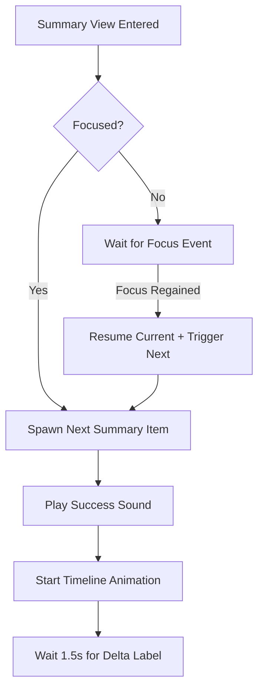
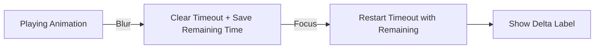

# Implementation Plan - Fix Ranked Summary Focus Resumption

Currently, the ranked summary animations and sounds pause when the window loses focus, but they don't resume immediately or correctly when focus is regained. This is due to absolute timing offsets and a lack of state tracking in the animation sequence.

## Gist
The goal is to move from a "pre-scheduled" animation model to a "sequential queue" model. We will track the animation state of each summary item and ensure the next item in the sequence only starts once the previous one is done and the browser is focused.

1. **Sequential Queue in `RankedView`**: Replace index-based `setTimeout` with a state-driven loop that spawns the next item only when focus allows.
2. **Interruptible Timers in `SummaryTimelineComponent`**: Add `pause()` and `resume()` to handle the internal delta label animation delay.
3. **Focus Synchronization**: Ensure that `onFocus` triggers an immediate "catch-up" for the next pending animation.

## Proposed Changes

### 1. `SummaryTimelineComponent.ts`
- Add `_pauseStartTime: number | null` to track when the delta timeout was interrupted.
- Add `_remainingDeltaDelay: number` (default 1500ms).
- Implement `pause()`: Clear `_playTimeout` and calculate remaining time.
- Implement `resume()`: If `_hasStarted` but `!_isDeltaAnimating`, restart the timeout with the remaining delay.

### 2. `RankedView.ts`
- Remove index-based math in `_playSummaryAnimations()`.
- Implement `_processSummaryQueue()`:
    - Finds the first scenario that hasn't been added yet.
    - If found, schedules its addition with a fixed delay (e.g., 1000ms).
    - If the item exists but hasn't started its timeline, triggers it immediately on focus.
- Update `_onBrowserFocus()` to call `_processSummaryQueue()` and `resume()` on all active summary timelines.
- Update `_onBrowserBlur()` (via common focus handler) to call `pause()` on all active summary timelines.

### 3. Visual Synchronization
- Ensure `animate-on-focus` works correctly with CSS transitions to freeze progress bars mid-motion.

## Diagrams

### Summary Animation Flow

### Component Focus Handling

