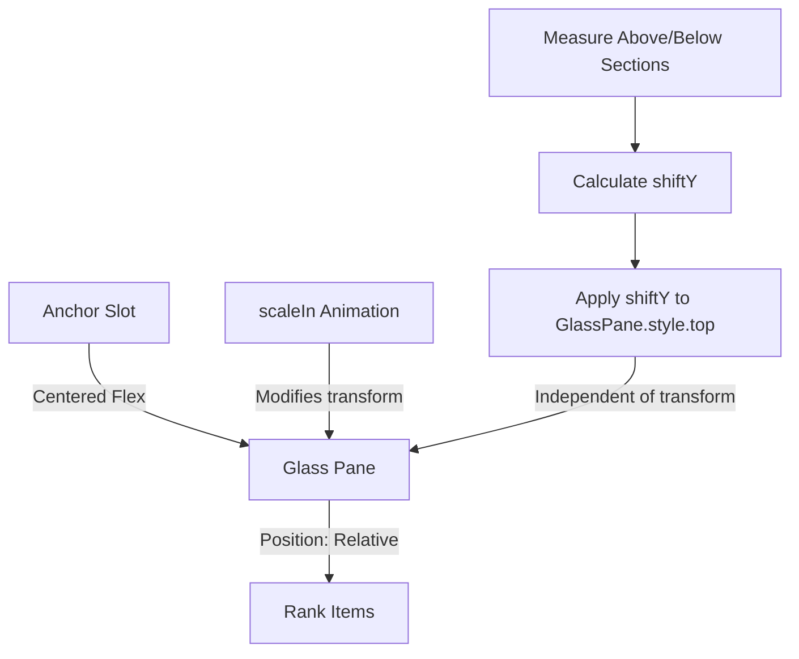

# Implementation Plan - Fix Rank Popup Initial Positioning

## Gist
The rank popup UI currently suffers from a momentary positioning error on initial load. The popup is intended to appear "around" the existing rank text, but it briefly appears vertically centered in its anchor before snapping to the correct position. 

This happens because `RankPopupComponent.ts` uses `transform: translateY()` to align the current rank with the anchor, but the `.settings-menu-container` class (reused from the settings menu) has a CSS `scaleIn` animation that also modifies the `transform` property. During the animation's 0.25s duration, the CSS animation takes priority over the inline `translateY`, causing the shift to be ignored until the animation completes.

The solution is to use `position: relative` and the `top` property for the alignment shift, which are independent of the `transform` property used by the animation.

## Proposed Changes

### 1. Update `src/components/ui/RankPopupComponent.ts`

-   Change the initialization of the glass pane to use `position: relative` instead of `static`.
-   Change the layout adjustment in `render()` to use the `top` style property instead of `transform: translateY`.

## Verification Plan

### Manual Verification
1.  Open the application.
2.  Click on the holistic rank estimate to open the rank popup.
3.  Observe the popup's appearance:
    -   It should appear immediately aligned with the existing rank text.
    -   There should be no "jump" or "snap" after the initial appearance.
    -   The scale animation should still be visible and centered on the current rank.

### Automated Tests
-   Run existing tests to ensure no regressions in rank calculation or component rendering.
-   `npm run test`
