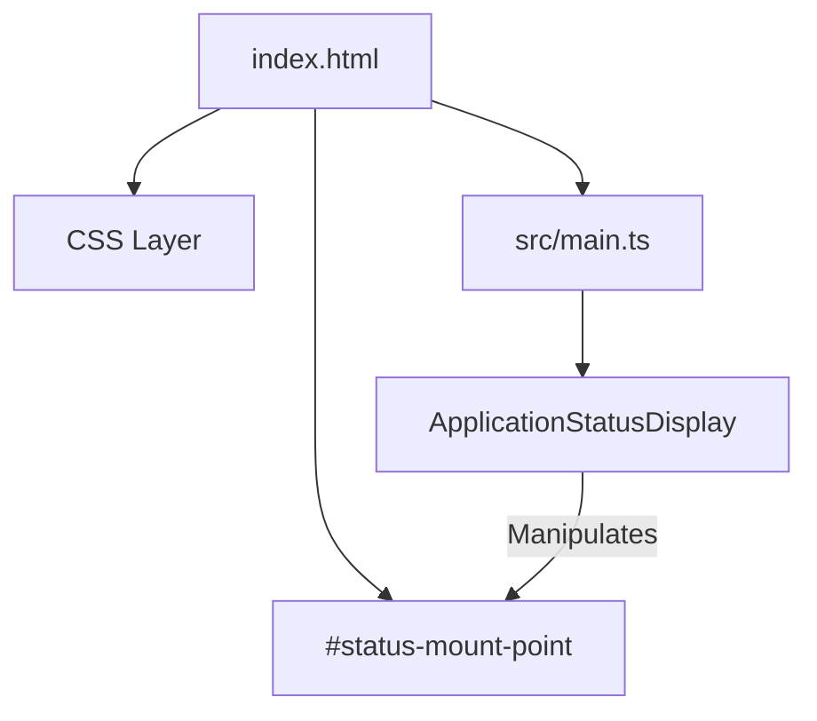
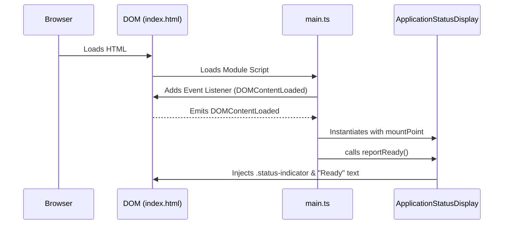
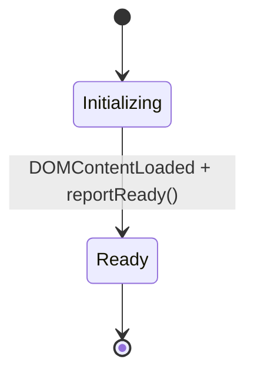

# System Architecture - Checkpoint 1.1

This document describes the architectural state of **Raw Output** at the end of Checkpoint 1.1 (Project Initialization).

## 1. High-Level Overview
The application is a single-page web application (SPA) built using a **Vanilla TypeScript** approach on top of the **Vite** build engine. The architecture prioritizes low-overhead runtime performance and a separation of concerns between UI presentation and application status management.

## 2. Core Components

### 2.1 The Static Shell ([`index.html`](../index.html))
The static shell acts as the primary "viewport" for the application. It contains:
- **Styling Layer**: A CSS-in-HTML approach using modern properties (`backdrop-filter`, `linear-gradients`) to achieve a glassmorphic aesthetic.
- **Mount Points**: Semantic `id` anchors (e.g., [`#status-mount-point`](../index.html#L106)) used by the TypeScript engine to inject dynamic content.

#### Component Diagram

- **Entities**: [`index.html`](../index.html) | [`CSS Layer`](../index.html#L12) | [`#status-mount-point`](../index.html#L106) | [`src/main.ts`](../src/main.ts) | [`ApplicationStatusDisplay`](../src/main.ts#L6)
- **Relationships**: [`Manipulates`](../src/main.ts#L19)

### 2.2 The Application Orchestrator ([`src/main.ts`](../src/main.ts))
The TypeScript layer follows an object-oriented pattern to manage initialization.
- **[`ApplicationStatusDisplay`](../src/main.ts#L6) Class**: Encapsulates the logic for interacting with the DOM status elements.
- **Initialization Lifecycle**: Uses the `DOMContentLoaded` event to trigger the sequence.

#### Initialization Flow

- **Entities**: [`DOM (index.html)`](../index.html) | [`main.ts`](../src/main.ts) | [`ApplicationStatusDisplay`](../src/main.ts#L6)
- **Messages**: [`Adds Event Listener (DOMContentLoaded)`](../src/main.ts#L47) | [`Emits DOMContentLoaded`](../src/main.ts#L47) | [`Instantiates with mountPoint`](../src/main.ts#L43) | [`calls reportReady()`](../src/main.ts#L44) | [`Injects .status-indicator & "Ready" text`](../src/main.ts#L13)

## 3. Build & Development Pipeline
- **Vite**: Handles the Hot Module Replacement (HMR) and asset bundling. It is configured to treat the project as a modern ESM module.
- **TypeScript**: Configured with strict type-checking to prevent common runtime errors and ensure that DOM interactions are safe.

## 4. Current State Machine
At this checkpoint, the application exists in a single-state:
- **Ready State**: Triggered immediately upon successful instantiation of the orchestrator.

- **Entities**: [`Ready`](../src/main.ts#L13)
- **Transitions**: [`DOMContentLoaded + reportReady()`](../src/main.ts#L13)
