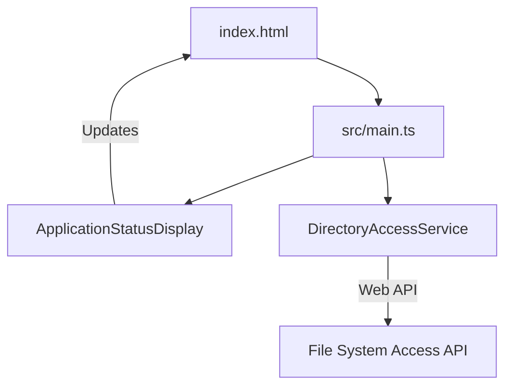
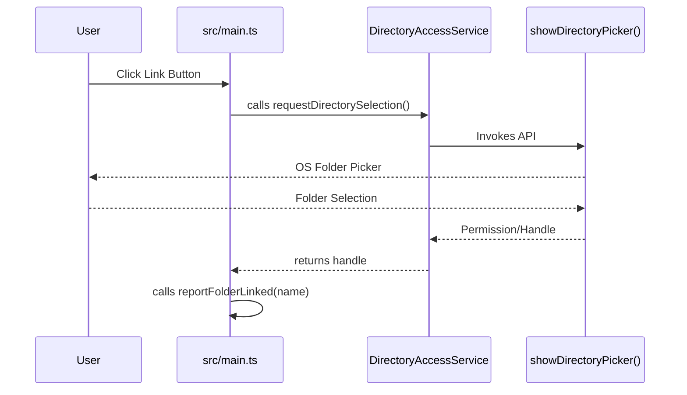
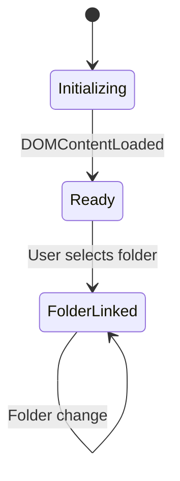

# System Architecture - Checkpoint 1.1

This document describes the architectural state of **Raw Output** at the end of Checkpoint 1.1 (Project Initialization).

## 1. High-Level Overview
The application is a single-page web application (SPA) built using **Vanilla TypeScript** and **Vite**. It leverages the **File System Access API** to interact with the local machine, managed via a service-oriented layer.

## 2. Core Components

### 2.1 The Static Shell ([`index.html`](../../../index.html))
The interface provides the visual and interactive anchors for the application.
- **Styling Layer**: Glassmorphic CSS with custom gradients in [`index.html`](../../../index.html#L11).
- **Action Wrapper**: Contains the [`#link-folder-button`](../../../index.html#L255) and [`#folder-status`](../../../index.html#L259).

#### Component Diagram

- **Entities**: [`index.html`](../../../index.html) | [`src/main.ts`](../../../src/main.ts#L1) | [`DirectoryAccessService`](../../../src/services/DirectoryAccessService.ts#L7)

### 2.2 The Application Orchestrator ([`src/main.ts`](../../../src/main.ts))
Orchestrates UI updates and listens for user interactions.
- **[`ApplicationStatusDisplay`](../../../src/main.ts#L11) Class**: Manages DOM updates for status and folder connectivity.
- **[`DirectoryAccessService`](../../../src/services/DirectoryAccessService.ts#L7) Class**: Interacts with the browser's folder picker.

#### Connectivity Flow

- **Entities**: [`src/main.ts`](../../../src/main.ts) | [`DirectoryAccessService`](../../../src/services/DirectoryAccessService.ts#L7)
- **Messages**: [`requestDirectorySelection()`](../../../src/services/DirectoryAccessService.ts#L22) | [`showDirectoryPicker()`](../../../src/types/fileSystem.d.ts#L36) | [`reportFolderLinked()`](../../../src/main.ts#L26)

## 3. Build & Development Pipeline
- **Vite**: Modern ESM-based build engine.
- **TypeScript**: Strict type-checking with custom definitions for experimental APIs in [`src/types/fileSystem.d.ts`](../../../src/types/fileSystem.d.ts).

## 4. Current State Machine
The application manages initialization and external resource discovery.

- **Entities**: [`Ready`](../../../src/main.ts#L20) | [`FolderLinked`](../../../src/main.ts#L26)
- **Transitions**: [`DOMContentLoaded`](../../../src/main.ts#L143) | [`User selects folder`](../../../src/main.ts#L136)
