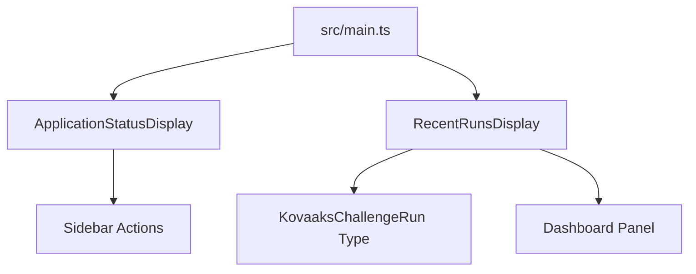
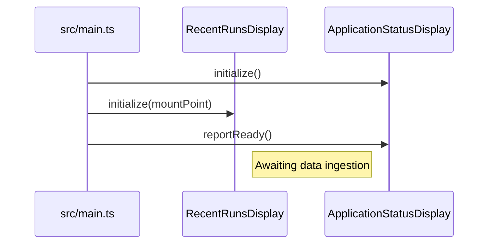
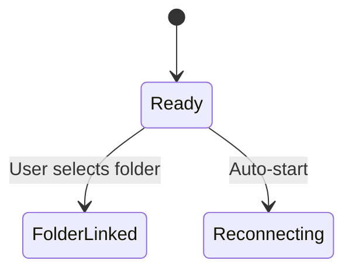

# System Architecture - Checkpoint 1.4

This document describes the architectural state of **Raw Output** at the end of Checkpoint 1.4 (Recent Runs UI).

## 1. High-Level Overview
Checkpoint 1.4 transitions the application from a single-card landing page to a **Dashboard Layout**. It introduces the first functional UI component for data visualization: the `RecentRunsDisplay`.

## 2. Core Components

### 2.1 Dashboard Layout ([`index.html`](../../../index.html))
The layout now uses a CSS Grid system to separate administrative controls from data displays.
- **Sidebar (`aside`)**: Contains the application title, connection status, and [`folder selection controls`](../../../index.html#L251).
- **Main Panel (`main`)**: A dedicated glassmorphic container for the [`Recent Runs list`](../../../index.html#L261).

### 2.2 Recent Runs Display ([`src/components/RecentRunsDisplay.ts`](../../../src/components/RecentRunsDisplay.ts))
A specialized component responsible for rendering a list of training sessions.
- **Data Driven**: Accepts [`KovaaksChallengeRun`](../../../src/types/kovaaks.ts#L1) objects and generates corresponding [`DOM elements`](../../../src/components/RecentRunsDisplay.ts#L22).

#### Component Diagram

- **Entities**: [`RecentRunsDisplay`](../../../src/components/RecentRunsDisplay.ts#L3) | [`KovaaksChallengeRun`](../../../src/types/kovaaks.ts#L1) | [`renderRuns`](../../../src/components/RecentRunsDisplay.ts#L10)

### 2.3 Application Orchestration ([`src/main.ts`](../../../src/main.ts))
The entry point has been updated to handle the dual initialization of the status display and the runs display.

#### Initialization Flow

## 3. Visual Specifications
- **Glassmorphism**: 12px backdrop blur with [`rgba(255, 255, 255, 0.03)`](../../../index.html#L16) background and subtle borders.
- **Typography**: Uses the 'Outfit' font family with varying weights to establish hierarchy.
- **Interactivity**: Custom scrollbar styling and [`hover micro-animations`](../../../index.html#L198) on list items.

## 4. Current State Machine
The application maintains the previous states.

- **Entities**: [`Ready`](../../../src/main.ts#L20)
