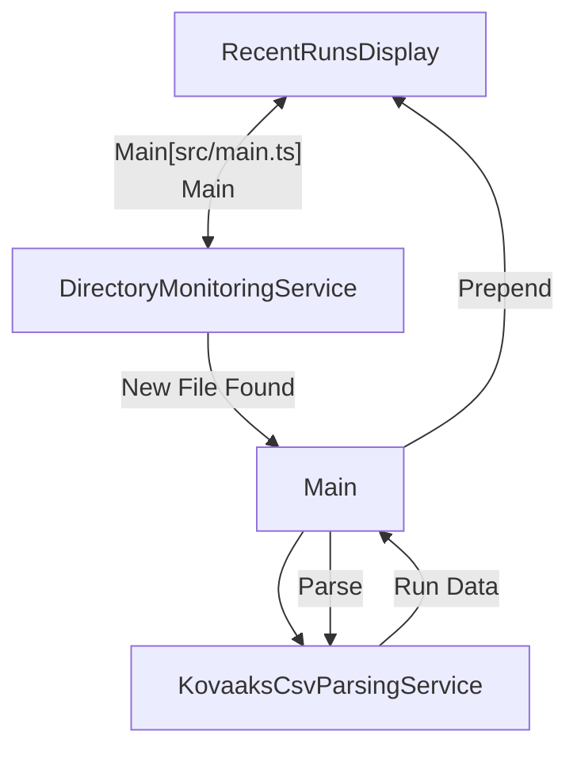
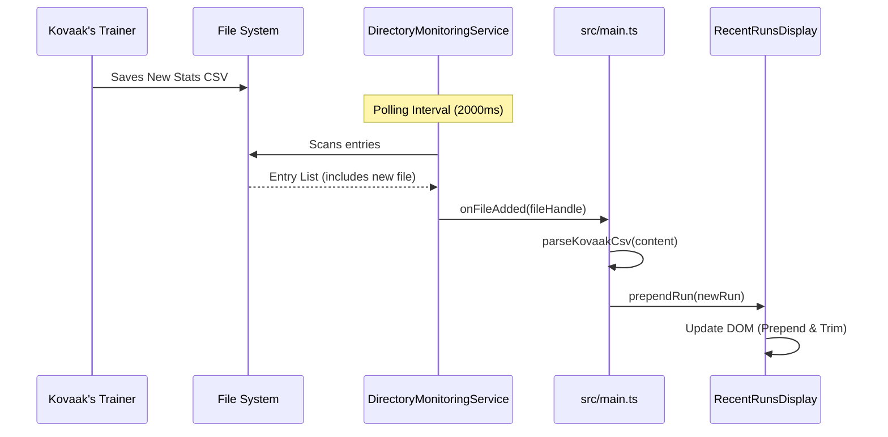
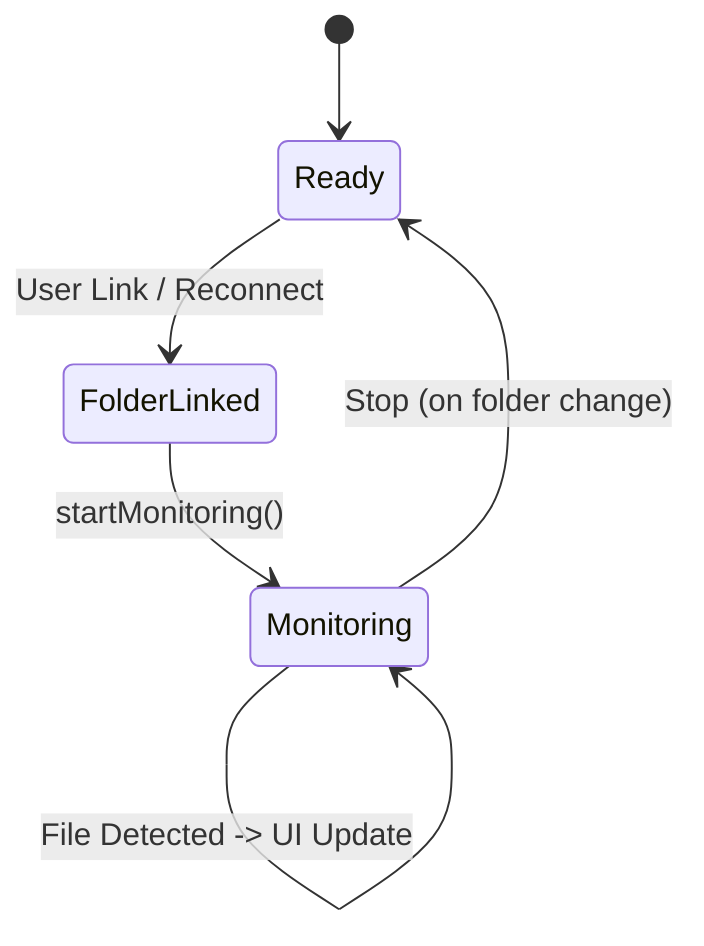

# System Architecture - Checkpoint 1.7

This document describes the architectural state of **Raw Output** at the end of Checkpoint 1.7 (Real-time File Ingestion).

## 1. High-Level Overview
Checkpoint 1.7 fulfills the "Zero Manual Effort" promise by introducing a directory monitoring loop. The application now automatically detects new `.csv` files saved by Kovaak's and updates the dashboard in real-time without user intervention.

## 2. Core Components

### 2.1 Directory Monitoring Service ([`src/services/DirectoryMonitoringService.ts`](../../../src/services/DirectoryMonitoringService.ts))
A polling-based service that watches for file system changes.
- **Stateful Tracking**: Maintains a `Set` of known filenames to identify additions.
- **Polling Loop**: Periodically scans the directory handle using the File System Access API.

### 2.2 UI Integration ([`src/components/RecentRunsDisplay.ts`](../../../src/components/RecentRunsDisplay.ts))
- **`prependRun()`**: Allows adding new data points to the top of the list while maintaining the 10-item display limit.

#### Component Diagram

## 3. Real-time Ingestion Flow
The process from file creation to UI update.

#### Monitoring & Ingestion Sequence

- **Entities**: [`DirectoryMonitoringService`](../../../src/services/DirectoryMonitoringService.ts) | [`RecentRunsDisplay`](../../../src/components/RecentRunsDisplay.ts)
- **Key Method**: [`startMonitoring()`](../../../src/services/DirectoryMonitoringService.ts#L16) | [`prependRun()`](../../../src/components/RecentRunsDisplay.ts#L22)

## 4. Current State Machine
The application now enters an active "Monitoring" state once a folder is linked.

## 5. Performance Considerations
- **Non-blocking Polling**: The monitoring service uses an `_isPolling` flag to ensure that if a disk read takes longer than the interval, multiple polls do not overlap.
- **Memory Management**: The `Set` of known files is cleared when monitoring stops to prevent memory leaks during long sessions or folder switches.