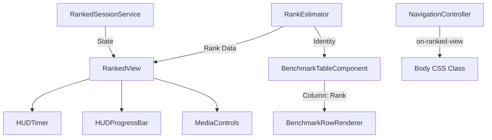

# Checkpoint 4.2 Architecture - HUD & Refinement

## Gist
Implemented and refined the HUD and UI elements for Ranked mode, ensuring visual stability, mechanical consistency, and verifiable results.

## Moving Parts

### 1. HUD Components
- **HUDTimer**: Tracks and displays elapsed time since the session start.
- **HUDProgressBar**: Visualizes progress through the 3-scenario gauntlet and infinite extensions. Markers were removed to create a cleaner "filling" aesthetic.

### 2. Ranked View UI
- **Media Player Controls**: Replaced text buttons with SVC icons (Back, Play, Next).
    - **Back**: Retreats to previous scenarios using `RankedSessionService.retreat()`.
    - **Play**: Launches the scenario using the verified KovaaK's URI protocol.
    - **Next**: Advances the sequence, pulsing when an improvement is detected.
- **Holistic Rank**: Displays the average rank across all scenarios for the selected difficulty in the header.

### 3. Layout Symmetry & Stability
- **Header Aligner**: Uses `inline-grid` to ensure the Difficulty Selector and Holistic Rank have exactly the same width.
- **Navigation Sync**: Verified with `HeaderSymmetry.test.ts` and `DifficultyPositionSync.test.ts`.
- **Targeted Blur**: Applied `backdrop-filter: blur(15px)` to background elements *within* the dashboard panel during active sessions, isolating the mission HUD.

### 4. Benchmark Table Integration
- **Rank Column**: Renamed from "Identity" to "Rank" for clarity. Displays the evolving skill floor based on the asymptotic decay system.
- **Launch Sync**: The Play button URI in Ranked mode was synchronized with the Benchmark Table's hold-to-launch logic.

## Logic Changes
- **RankedSessionService**: Added `retreat()` to allow users to go back in the sequence.
- **RankedView**: Consolidated holistic rank calculation into `_calculateHolisticIdentityRank()` to ensure the summary screen matches the header and table.
- **CSS Architecture**: Introduced `components.css` for cross-cutting layout concerns like header symmetry and session-active blurs.
