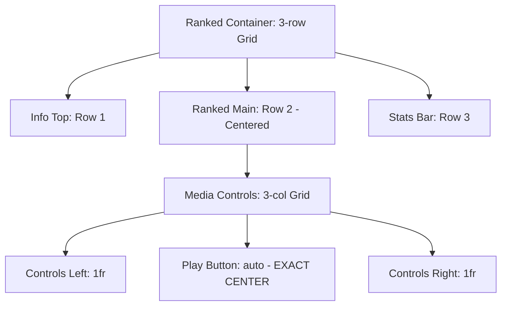

# Checkpoint 4.4 Architecture: Ranked UI Zen & Symmetry

## Gist
Implemented a "Zen" aesthetic for the Ranked session UI, focusing on mathematical symmetry, minimal clutter, and zero layout shift between states. The primary interaction point (Play button) is now locked to the absolute center of the container using CSS Grid.

## Moving Parts

### 1. Vertical & Horizontal Centering
- **Ranked Container**: Refactored to a `display: grid` with `grid-template-rows: 1fr auto 1fr`. This ensures the center row (Play controls) is vertically centered regardless of content in the top (Scenario info) or bottom (Stats) rows.
- **Media Controls**: Refactored to a `display: grid` with `grid-template-columns: 1fr auto 1fr`. This ensures the Play button is horizontally centered, regardless of how many controls occupy the left (Back) or right (Next, End) clusters.

### 2. Zen Idle UI
- **Zero Layout Shift**: The Idle (launch) state now uses the identical structural HTML as the Active state.
- **Invisible placeholders**: Scenario info and stats are present but set to `visibility: hidden` in Idle mode. This preserves their layout box, ensuring the Play button never jumps when a session starts.
- **Minimalism**: Removed all instructional text and "Guided Progression" info cards to maintain focus on the core action.

### 3. Navigation & Iconography
- **Media Bar Integration**: "End Run" is now a destructive icon-only button within the central control cluster.
- **Discouraged but Unlocked**: The "Next" button is no longer locked (disabled) if targets are missed. Instead, it uses a `.dull` (grayscale/low opacity) style, allowing player agency while visually prioritizing the "intended" path.
- **Passive Interaction**: Disabled buttons use `pointer-events: none` and `cursor: default` to truly recede from user interaction.

## Logic Changes
- **RankedView**: Updated template generation to support the split-row grid architecture.
- **CSS Architecture**: Migrated media bar layouts from Flexbox to Grid for guaranteed mathematical centering.

## Verification
- **RankedPlayCentering.test.ts**: Verifies horizontal centering of the play button.
- **RankedIdleActiveSymmetry.test.ts**: Verifies that the play button does not move a single pixel during the transition from Idle to Active.
