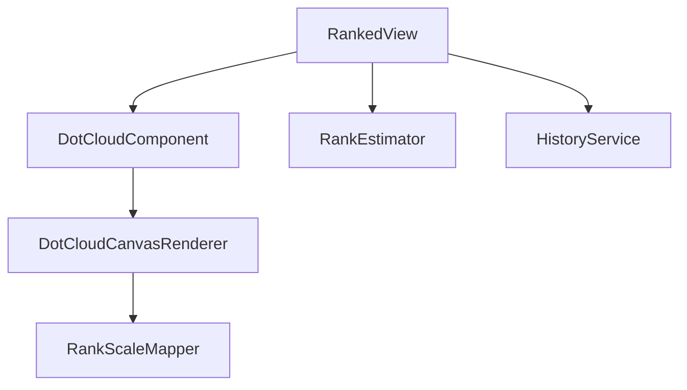

# Checkpoint 4.5 Architecture: Target RU & Session Visuals

## Gist
Implement high-precision performance visualization in the Ranked HUD by shifting focus from discrete ranks to "Rank Units" (RU) for targets, and providing immediate visual feedback via session-only dot clouds.

- **RU Targets**: Display targets as continuous numeric values (e.g., "7.45 RU") for higher resolution tracking.
- **Session-Only Dot Cloud**: A strip plot visualization that filters out historical noise, showing only current session performance.
- **Precision Target Notch**: A visual marker within the dot cloud indicating the specific RU level needed to evolve the scenario identity.
- **Standardized Rank Displays**: Unified "Rank Name + Progress %" layout across the whole application.

## Component Relationships

## Changes Detail

### 1. RU Metric Shift
The "TARGET" stat now displays the `continuousValue` (RU) of the holistic or scenario identity. This removes the ambiguity of "S-1" or "Plat 2" and provides a direct, granular goal for the user.

### 2. Session-Only Visualization
The dot cloud in the Ranked HUD is strictly isolated to the current session scores.
- **Filtering**: `history.getLastScores` is filtered by `session.sessionStartTimestamp`.
- **Target Notch**: A short, high-visibility notch (using `--vis-highlight-rgb`) is rendered at the RU position corresponding to the current persistent identity.
- **Style**: Centered in the middle of the `ranked-target` container, above the media controls.

### 3. Visual Refinement
- **Label Consistency**: `.stat-item .label` font-weight reduced to `400` to match the "Zen" aesthetic of the benchmark table headers.
- **Rank Display**: Achieved rank follows the "Gold +85%" format, consistent with row-level badges in the benchmark table.

## Data Flow: Target Notch Rendering
1. `RankedView` retrieves scenario identity RU.
2. `RankedView` passes `targetRU` to `DotCloudComponent`.
3. `DotCloudComponent` includes `targetRU` in the `RenderContext`.
4. `DotCloudCanvasRenderer` calculates horizontal position and draws a 40% height vertical line at that coordinate.
