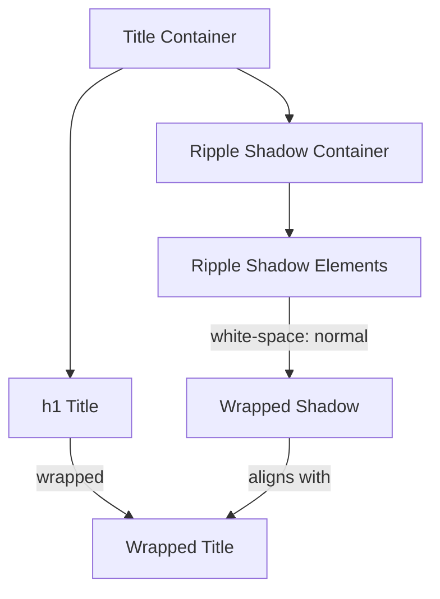

# Checkpoint 4.5 Architecture: HUD Integration & UI Refinements (Initial)

## Gist
Started the HUD integration phase by resolving layout-critical UI bugs and preparing the visual system for live feedback.

## Moving Parts

### 1. Title Ripple Shadow Synchronization
- **Problem**: At large UI scales or Narrow containers, the main title (`h1`) would wrap to a new line, but the ripple shadow elements (`.title-ripple`) would remain on a single line due to `white-space: nowrap`, causing visual misalignment.
- **Solution**: Removed `white-space: nowrap` from `.title-ripple`. Since the ripples share the same font metrics and parent container constraints as the title, they now wrap identically, maintaining the "shadow" effect even across multiple lines.

## Verification
- **Visual Inspection**: Verified that at high UI scale, the ripple shadow text wraps at the same break points as the main title text.
- **Layout Integrity**: Confirmed no regression in the absolute positioning of the ripples relative to the `app-title-container`.
