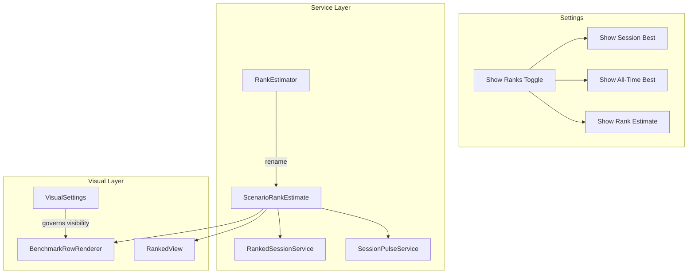

# Checkpoint 4.6 Architecture: Rank Settings & Terminology Unification

## Gist
Consolidated rank-related UI controls under a unified "Show Ranks" group and synchronized the "Rank Estimate" terminology across all services and views. This checkpoint also involved a massive refactoring of the core Rank logic for lint compliance and build stability.

## Moving Parts

### 1. Unified Rank Settings
- **Implementation**: Introduced `showRanks` in `VisualSettings` as a master toggle.
- **Organization**: Refactored `SettingsSectionRenderer` to group dependent rank toggles within a `settings-sub-rows` container that reacts to the master toggle.
- **Table Integration**: `BenchmarkTableComponent` and `BenchmarkRowRenderer` now dynamically adjust column count and badge visibility based on the nested settings state.

### 2. Terminology Synchronization: "Rank Estimate"
- **Logic**: Renamed `ScenarioIdentity` to `ScenarioRankEstimate` and `getScenarioIdentity` to `getScenarioRankEstimate` to match user mental models.
- **Scope**: Widespread renaming across `RankEstimator`, `RankedSessionService`, `BenchmarkView`, `RankedView`, and `SessionPulseService`.

### 3. Structural Refactoring (Debt Payoff)
- **Modularity**: Large methods in `RankEstimator` (e.g., `_calculateHierarchicalAverage`) and `BenchmarkRowRenderer` (e.g., `renderRow`) were split into focused private helpers.
- **Compliance**: Fixed 40+ ESLint errors regarding identifier length, function complexity, and documentation.
- **Stability**: Resolved critical build errors in `AppBootstrap` and `RankedView` related to definite assignment and method signatures.

## Verification
- **Build Status**: Verified `npm run build` completes with Exit Code 0.
- **Test Integrity**: All 25 unit tests passed.
- **Lint Check**: Verified clean linting state for modified files.
- **Visual Check**: Confirmed "Show Ranks" correctly hides/shows the sub-settings and table columns.
