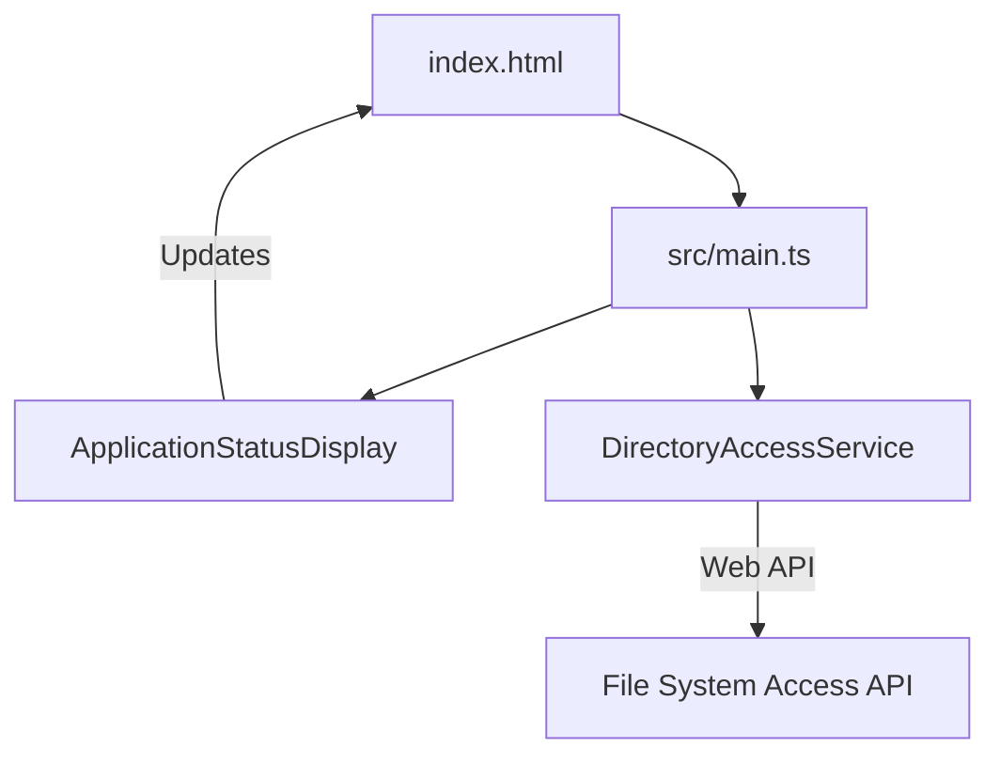
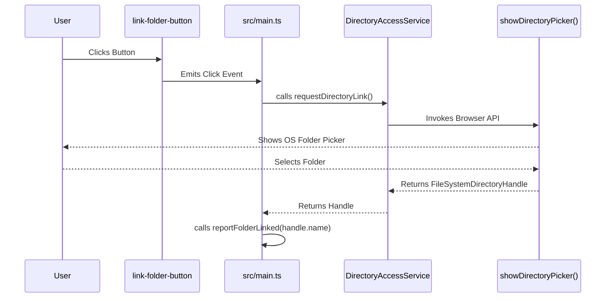
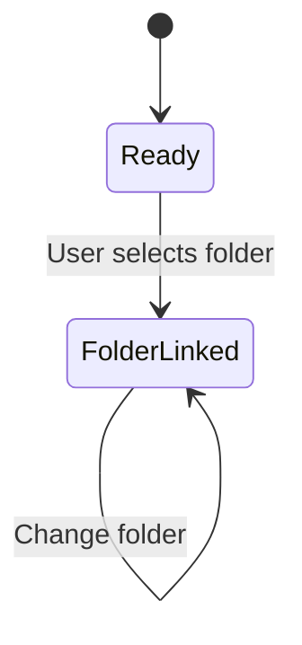

# System Architecture - Checkpoint 1.2

This document describes the architectural state of **Raw Output** at the end of Checkpoint 1.2 (Folder Picker Connectivity).

## 1. High-Level Overview
Checkpoint 1.2 introduces interactivity via the **File System Access API**. The architecture is extended with a service-oriented layer to handle persistent browser permissions and directory navigation.

## 2. Core Components

### 2.1 The Interface ([`index.html`](../index.html))
The UI now includes an interactive action layer:
- **Link Button**: A [`#link-folder-button`](../index.html#L109) with premium hover/active states.
- **Folder Status**: A [`#folder-status`](../index.html#L110) display area that dynamically updates upon successful link.

#### Component Diagram

- **Entities**: [`index.html`](../index.html) | [`src/main.ts`](../src/main.ts) | [`DirectoryAccessService`](../src/services/DirectoryAccessService.ts#L6)

### 2.2 Directory Access Layer ([`src/services/DirectoryAccessService.ts`](../src/services/DirectoryAccessService.ts))
A dedicated service for managing folder handles.
- **`requestDirectoryLink()`**: Triggers the OS folder picker.
- **Type Safety**: Supported by custom definitions in [`src/types/fileSystem.d.ts`](../src/types/fileSystem.d.ts).

#### Connectivity Flow

- **Entities**: [`link-folder-button`](../index.html#L109) | [`DirectoryAccessService`](../src/services/DirectoryAccessService.ts#L6)
- **Messages**: [`requestDirectoryLink()`](../src/services/DirectoryAccessService.ts#L13) | [`showDirectoryPicker()`](../src/types/fileSystem.d.ts#L10) | [`reportFolderLinked()`](../src/main.ts#L20)

## 3. Current State Machine
The application now supports two primary states.

- **Entities**: [`Ready`](../src/main.ts#L12) | [`FolderLinked`](../src/main.ts#L20)
- **Transitions**: [`User selects folder`](../src/main.ts#L42)
