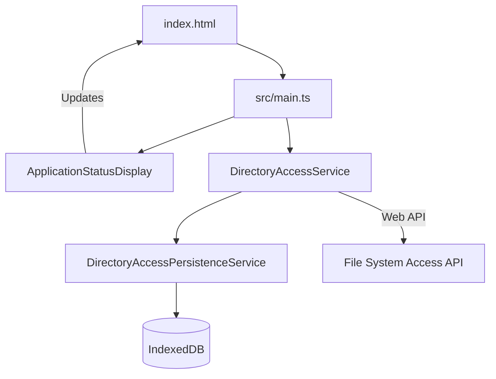
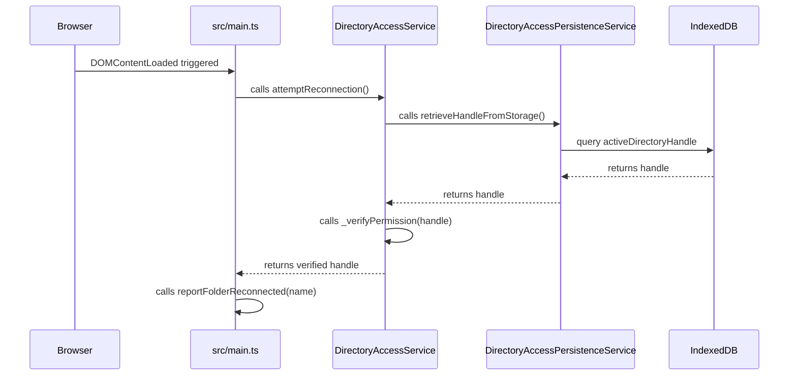
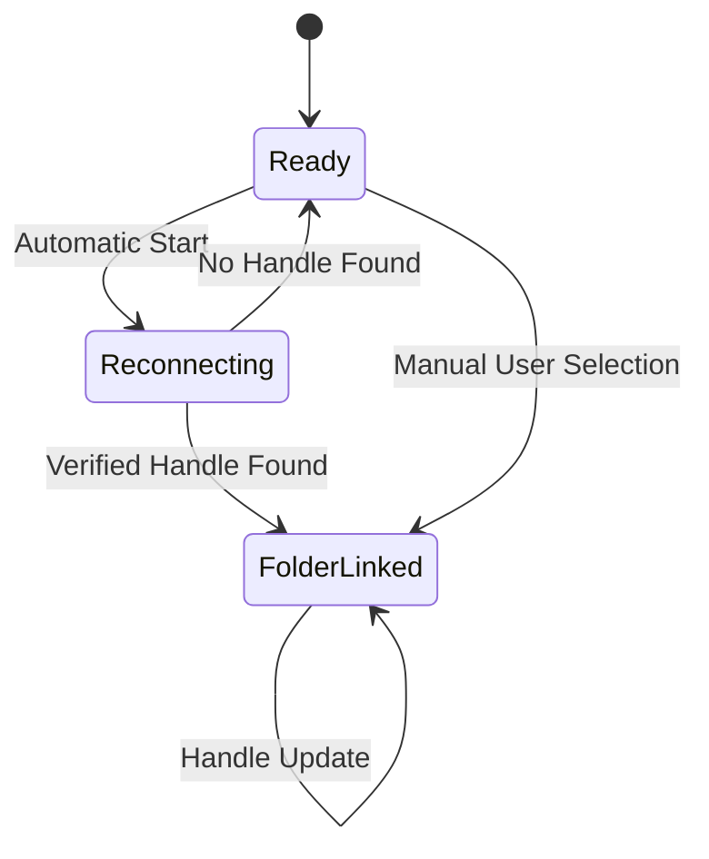

# System Architecture - Checkpoint 1.3

This document describes the architectural state of **Raw Output** at the end of Checkpoint 1.3 (Session Persistence).

## 1. High-Level Overview
Checkpoint 1.3 introduces local persistence using **IndexedDB**. The architecture is extended to support asynchronous storage and automatic reconnection of directory handles upon application initialization, fulfilling the "Zero Manual Effort" promise.

## 2. Core Components

### 2.1 Persistence Layer ([`src/services/DirectoryAccessPersistenceService.ts`](../../../src/services/DirectoryAccessPersistenceService.ts))
A new service dedicated to the storage and retrieval of `FileSystemDirectoryHandle` objects.
- **IndexedDB Integration**: Uses a structured database [`RawOutputStorage`](../../../src/services/DirectoryAccessPersistenceService.ts#L2) to store handles across browser sessions.
- **Asynchronous Storage**: Provides [`promise-based methods`](../../../src/services/DirectoryAccessPersistenceService.ts#L6) for atomic handle persistence.

### 2.2 Orchestration & Reconnection ([`src/services/DirectoryAccessService.ts`](../../../src/services/DirectoryAccessService.ts))
The directory service now manages the lifecycle of the folder link.
- **Reconnection Logic**: Attempts to restore state on startup by [`retrieving handles`](../../../src/services/DirectoryAccessService.ts#L36) from the persistence layer.
- **Permission Verification**: Uses [`queryPermission`](../../../src/services/DirectoryAccessService.ts#L54) to verify that the browser still has access to the stored handle before reporting success.

#### Component Diagram

- **Entities**: [`DirectoryAccessPersistenceService`](../../../src/services/DirectoryAccessPersistenceService.ts#L1) | [`DirectoryAccessService`](../../../src/services/DirectoryAccessService.ts#L7)

### 2.3 Application Lifecycle ([`src/main.ts`](../../../src/main.ts))
The initialization sequence now includes an automated reconnection phase.

#### Persistence & Reconnection Flow

- **Entities**: [`src/main.ts`](../../../src/main.ts) | [`DirectoryAccessService`](../../../src/services/DirectoryAccessService.ts#L7)
- **Messages**: [`attemptReconnection()`](../../../src/services/DirectoryAccessService.ts#L36) | [`retrieveHandleFromStorage()`](../../../src/services/DirectoryAccessPersistenceService.ts#L19) | [`reportFolderReconnected()`](../../../src/main.ts#L30)

## 3. Storage Schema
The application utilizes a single object store for administrative metadata.

| Database | Store | Key | Value |
| :--- | :--- | :--- | :--- |
| [`RawOutputStorage`](../../../src/services/DirectoryAccessPersistenceService.ts#L2) | [`DirectoryHandles`](../../../src/services/DirectoryAccessPersistenceService.ts#L3) | `activeDirectoryHandle` | `FileSystemDirectoryHandle` |

## 4. Current State Machine
The application now supports an automated transition from initialization to a linked state.

- **Entities**: [`Ready`](../../../src/main.ts#L20) | [`FolderLinked`](../../../src/main.ts#L26)
- **Transitions**: [`attemptReconnection()`](../../../src/services/DirectoryAccessService.ts#L36) | [`requestDirectorySelection()`](../../../src/services/DirectoryAccessService.ts#L22)
