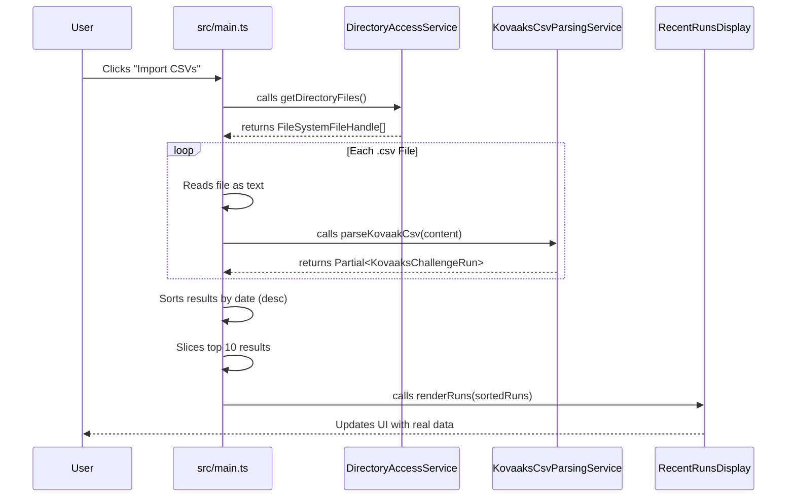
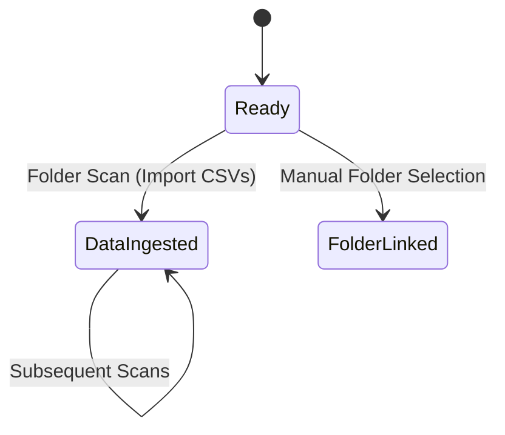

# System Architecture - Checkpoint 1.5

This document describes the architectural state of **Raw Output** at the end of Checkpoint 1.5 (Static CSV Parsing).

## 1. High-Level Overview
Checkpoint 1.5 introduces the core data extraction logic. The application can now ingest real performance data from **Kovaak's CSV files**, transforming raw text into structured `KovaaksChallengeRun` objects. This marks the transition from static placeholders to dynamic data visualization.

## 2. Core Components

### 2.1 Kovaak's CSV Parsing Service ([`src/services/KovaaksCsvParsingService.ts`](../../../src/services/KovaaksCsvParsingService.ts))
A stateless utility service designed to interpret the Kovaak's CSV schema.
- **Normalization**: Handles [`CSV cell cleanup`](../../../src/services/KovaaksCsvParsingService.ts#L25), removing quotes and whitespace.
- **Mapping**: Identifies key columns ([`Scenario`](../../../src/services/KovaaksCsvParsingService.ts#L30), [`Score`](../../../src/services/KovaaksCsvParsingService.ts#L31), [`Timestamp`](../../../src/services/KovaaksCsvParsingService.ts#L32)) and maps them to a structured [`Partial<KovaaksChallengeRun>`](../../../src/services/KovaaksCsvParsingService.ts#L29).
- **Multi-File Support**: The application loop processes multiple files, sorting by `completionDate` and displaying the top 10 most recent results.
- **Fault Tolerance**: Provides basic error handling for malformed CSVs or missing headers.

### 2.2 UI Integration ([`index.html`](../../../index.html))
The sidebar now includes an **Import CSVs** action to facilitate batch data validation directly from the linked stats folder.
- **`#import-csv-button`**: A secondary action [`button`](../../../index.html#L254) used to trigger a folder scan.

#### Data Ingestion Flow (Folder Scan)

- **Entities**: [`KovaaksCsvParsingService`](../../../src/services/KovaaksCsvParsingService.ts#L3) | [`handleFolderScan`](../../../src/main.ts#L88) | [`getDirectoryFiles`](../../../src/services/DirectoryAccessService.ts#L45)

### 2.3 Application Orchestration ([`src/main.ts`](../../../src/main.ts))
The main orchestrator now bridges the gap between the file system and the display component using the new parsing service.
- **`initializeApplication`**: Sets up [`event listeners`](../../../src/main.ts#L81) for folder scanning.
- **`handleFolderScan`**: Orchestrates the [`reading and parsing`](../../../src/main.ts#L88) of multiple files from the connected directory.

## 3. Data Schema: KovaaksChallengeRun
The `KovaaksChallengeRun` interface serves as the internal contract for performance data.

| Property | Type | Description |
| :--- | :--- | :--- |
| `id` | `string` | Unique identifier (generated via [`crypto.randomUUID`](../../../src/main.ts#L104)) |
| `scenarioName` | `string` | The name of the Kovaak's scenario |
| `score` | `number` | The numerical score achieved |
| `completionDate` | `Date` | The timestamp of the run |

- **Entities**: [`KovaaksChallengeRun`](../../../src/types/kovaaks.ts#L1)

## 4. Current State Machine
The application now supports a "Data Ingested" state, where user-provided content is rendered. Placeholders have been removed.

- **Transitions**: [`handleFolderScan`](../../../src/main.ts#L88)
