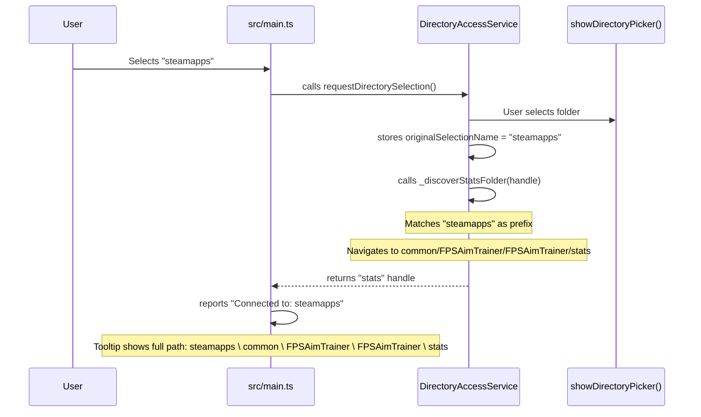
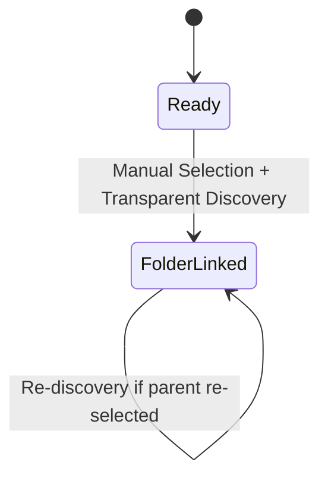

# System Architecture - Checkpoint 1.6

This document describes the architectural state of **Raw Output** at the end of Checkpoint 1.6 (Deep Directory Discovery).

## 1. High-Level Overview
Checkpoint 1.6 adds intelligence to the folder selection process. The application no longer requires the user to navigate deep into the Kovaak's installation; instead, it automatically discovers and targets the relevant `stats` folder by matching the selected directory against a known installation suffix.

## 2. Core Components

### 2.1 Directory Discovery Logic ([`src/services/DirectoryAccessService.ts`](../../../src/services/DirectoryAccessService.ts))
The `DirectoryAccessService` uses a deterministic suffix-matching mechanism to normalize the targeted path and provide transparency.
- **Suffix Template**: Defined as a constant [`_KOVAAKS_STATS_PATH_PARTS`](../../../src/services/DirectoryAccessService.ts#L8): `["steamapps", "common", "FPSAimTrainer", "FPSAimTrainer", "stats"]`.
- **Transparent Navigation**: The [`_discoverStatsFolder`](../../../src/services/DirectoryAccessService.ts#L84) method identifies if the selected folder's name matches any prefix of this template.
- **Logical Path Reconstruction**: As the service descends into subdirectories, it reconstructs the logical path (e.g., `steamapps \ common \ ... \ stats`).
- **Dual Tracking**: The service maintains both:
  - [`_originalSelectionName`](../../../src/services/DirectoryAccessService.ts#L13): The folder name the user actually selected (for UI display)
  - [`_directoryHandle`](../../../src/services/DirectoryAccessService.ts#L11): The discovered `stats` folder handle (for data access)
- **UI Transparency**: 
  - The original selection name is displayed in the "Connected to:" UI via [`originalSelectionName`](../../../src/services/DirectoryAccessService.ts#L73)
  - The full logical path is exposed via [`fullLogicalPath`](../../../src/services/DirectoryAccessService.ts#L69) and displayed as a tooltip (hover)
  - This ensures users see the folder they gave permission to, while the app works with the correct data source
- **Normalization**: Ensures that the internal `_directoryHandle` always points to the folder containing the actual CSV logs.

#### Discovery Flow

- **Entities**: [`DirectoryAccessService`](../../../src/services/DirectoryAccessService.ts#L7) | [`_discoverStatsFolder`](../../../src/services/DirectoryAccessService.ts#L89) | [`requestDirectorySelection`](../../../src/services/DirectoryAccessService.ts#L23) | [`_handleSuccessfulSelection`](../../../src/services/DirectoryAccessService.ts#L77)

### 2.2 Persistence Strategy ([`src/services/DirectoryAccessPersistenceService.ts`](../../../src/services/DirectoryAccessPersistenceService.ts))
The persistence layer stores **both** pieces of information to maintain UI consistency across sessions:
- **Directory Handle**: The discovered `stats` folder handle is saved via [`saveHandleToStorage`](../../../src/services/DirectoryAccessPersistenceService.ts#L6)
- **Original Selection Name**: The folder name the user selected is saved alongside the handle
- **Dual Retrieval**: [`retrieveHandleFromStorage`](../../../src/services/DirectoryAccessPersistenceService.ts#L19) returns both values as `{ handle, originalName }`
- **Reconnection Behavior**: Upon reconnection, the UI displays the original folder name while the app continues to work with the `stats` folder

This dual-persistence ensures that:
1. The app remains pinned to the correct data source (`stats` folder)
2. The UI accurately reflects what the user gave permission to (e.g., `steamapps`)
3. Users understand the permission scope without confusion

## 3. Current State Machine
The "Folder Linked" state represents a successfully discovered and validated data source.

- **Transitions**: [`_handleSuccessfulSelection`](../../../src/services/DirectoryAccessService.ts#L76) | [`attemptReconnection`](../../../src/services/DirectoryAccessService.ts#L38)
