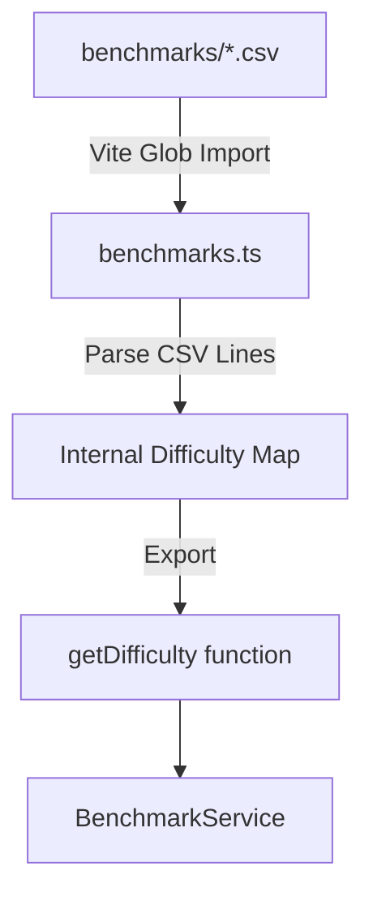
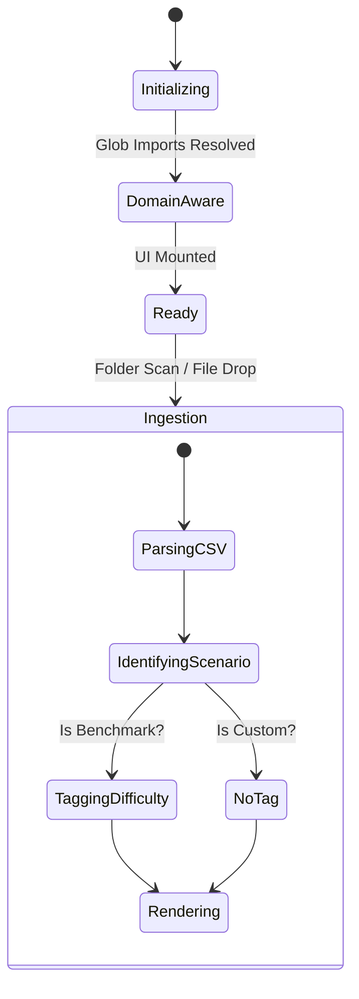

# System Architecture - Checkpoint 2.1

This document describes the architectural state of **Raw Output** at the end of Checkpoint 2.1 (Dynamic Scenario Intelligence).

## 1. High-Level Overview
The system has been upgraded with **Domain Intelligence**, allowing it to recognize and categorize Kovaak's scenarios based on the Viscose Benchmark suite. Instead of hardcoding scenario names, the application dynamically pulls intelligence from the source CSV files in the `benchmarks/` directory.

## 2. Dynamic Intelligence Layer

### 2.1 CSV-to-Benchmark Loader ([`src/data/benchmarks.ts`](../../../src/data/benchmarks.ts))
This module handles the extraction and mapping of benchmark standards.

- **Logic**: The loader extracts scenario names from the first column of each CSV, respecting quoted strings and commas. 
- **Mapping**: Difficulty levels are derived from the filenames (`ranks_easier.csv`, `ranks_medium.csv`, `ranks_hard.csv`).

### 2.2 Benchmark Service ([`src/services/BenchmarkService.ts`](../../../src/services/BenchmarkService.ts))
A lightweight service layer that abstracts the benchmark lookup logic from the main application orchestrator.
- **Method `getDifficulty(name)`**: Consults the dynamic map to return the specific `BenchmarkDifficulty` or `null` if the scenario is not part of the benchmark suite.

## 3. UI & Component Integration

### 3.1 Recent Runs Display ([`src/components/RecentRunsDisplay.ts`](../../../src/components/RecentRunsDisplay.ts))
The display logic now supports conditional metadata rendering based on the scenario's difficulty.
- **Conditional Tagging**: The UI template checks for the existence of the `difficulty` property. If found, it renders a specialized badge; otherwise, it renders no tag.
- **Dynamic Styling**: Logic-driven classes (`tag-easier`, `tag-medium`, `tag-hard`) apply unique color identities.

### 3.2 Visual Identity ([`index.html`](../../../index.html))
The CSS layer has been updated with a color-coded hierarchy for benchmark tiers:
- **Easier (Emerald)**: `#10b981` - Signifies entry-level standards.
- **Medium (Cyan)**: `#00f2ff` - Signifies intermediate/core standards.
- **Hard (Amber)**: `#f59e0b` - Signifies advanced/elite standards.

## 4. Extended State Machine
The application now includes "Domain Awareness" during the ingestion of Kovaak's files.

## 5. Technical Constraints & Decisions
- **Build-Time Bundling**: By using `?raw` imports, benchmark scenarios are bundled into the JavaScript assets. This ensures zero-latency scenario identification but requires a rebuild if the source CSVs are modified.
- **Priority Resolution**: If a scenario name exists in multiple difficulty files, the system defaults to the highest difficulty (Hard > Medium > Easier) to ensure users are rewarded for their highest possible tier.
- **Clean Fallbacks**: Non-benchmark (Custom) scenarios are explicitly untagged to maintain a clean, focus-oriented UI for competitive training.