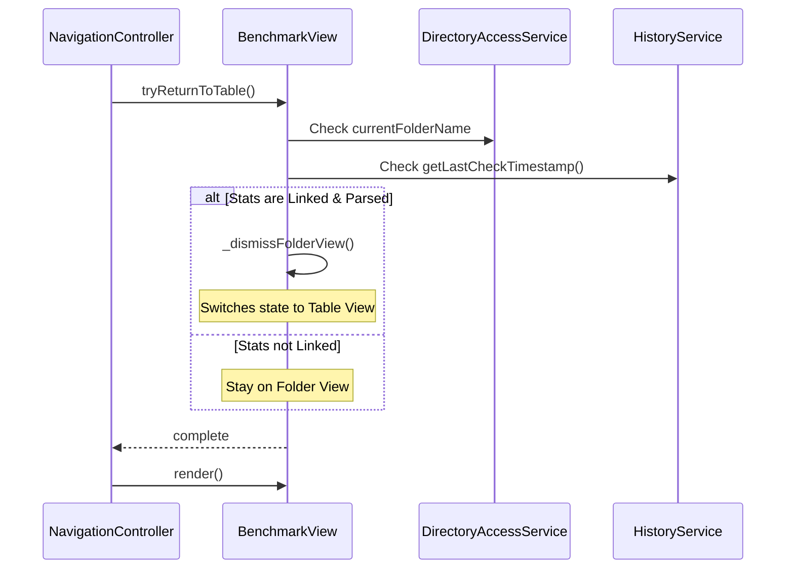

## 4. CSS Structural Changes

- **`.folder-settings-intro-column`**: Changed to `justify-content: stretch` to allow child flex groups to expand.
- **`.intro-text-content`**: Set to `height: 100%` to provide a full-height container for the introduction groups.
- **`.app-introduction`**: Converted to a flex container with `flex-direction: column` and `height: 100%`.
- **`.intro-top-group`, `.intro-bottom-group`**: Assigned `flex: 1` and `display: flex` with `justify-content: center` to vertically center their own contents within their respective halves.
- **`.intro-separator`**: Removed fixed margins in favor of flex-basis alignment and `margin: 0 auto`.