# Commit: Corrected Scenario Name Column Width Regression

## Gist
Resolved a layout regression where the scenario name column in the benchmark table was excessively wide due to double-scaling of its width reservation.

## Key Changes
- **Regression Detection**: Implemented a pixel-perfect "Ink Width" test suite in `BenchmarkTable.test.ts` that uses a canvas to measure actual text rendering against DOM reservations.
- **Scaling Correction**: Refactored `ScenarioNameWidthManager.ts` to correctly convert measured pixels to `rem` units by using the current scaled root font size, eliminating the redundant multiplication by the master scale.
- **Magic Number Elimination**: Factored out the `1.5` padding (later optimized to `0.2`) into a static constant `SCENARIO_NAME_PADDING_REM` shared between the manager and the tests.
- **Layout Tightening**: Reduced the default horizontal padding for scenario names to `0.2rem` for a more premium, high-density aesthetic.

## Architecture & Principles
- **Embedded Documentation**: Updated `ScenarioNameWidthManager` with clear API documentation.
- **Short Methods**: All new and refactored logic is broken down into concise, single-purpose helpers (e.g., `_scanForRightmostOpaquePixel`, `_calculateInkWidthsForScenarios`).
- **Explicit Types**: Applied strict TypeScript annotations to all new testing and production code.

## Verification
- `BenchmarkTable Page Layout > scenario name column should be tight to the maximum ink width of all names`: **PASS**
- `BenchmarkTable Page Layout > all scenario name columns should have identical reserved widths`: **PASS**
- `BenchmarkTable Page Layout > all scenarios should be present in the rendered table`: **PASS**

```mermaid
graph LR
    A[ScenarioNameWidthManager] -- measures --> B(Canvas Text Metrics)
    B -- pixel width --> C{Conversion Logic}
    C -- ÷ Root Font Size --> D[rem Width]
    D -- CSS variable --> E(.scenario-name Width)
    E -- validates --> F[Test: Ink vs Reserved]
```

