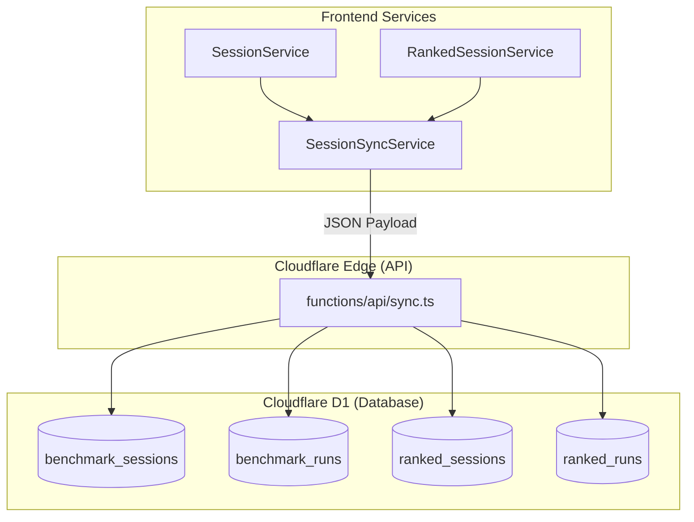

# Database Schema Design

This document explains the architecture of the **Raw Output** telemetry and session persistence layer.

## Overview

The database handles two types of data:
1.  **Benchmark Data**: General session metadata and "Session Best" performance records per scenario.
2.  **Ranked Data**: Detailed historical data for explicit "Ranked" gauntlets.

## Table Definitions

### `benchmark_sessions`
Metadata for general play sessions. A session is a period of activity tied to a unique ID and a specific device.

| Column | Type | Description |
| :--- | :--- | :--- |
| `device_id` | TEXT | Primary Key (Composite) |
| `session_id` | TEXT | Primary Key (Composite) |
| `session_date` | TEXT | Date (YYYY-MM-DD) for grouping |

### `benchmark_runs`
Records the **best** performance achieved for each scenario during a single benchmark session.

| Column | Type | Description |
| :--- | :--- | :--- |
| `device_id` | TEXT | Primary Key (Composite) |
| `session_id` | TEXT | Primary Key (Composite) |
| `scenario_name`| TEXT | Primary Key (Composite) |
| `best_score` | REAL | Numerical highscore for the session |
| `is_ranked_mode`| INTEGER | 1 if achieved during a ranked session |

### `ranked_sessions`
Metadata for explicit Ranked gauntlets.

| Column | Type | Description |
| :--- | :--- | :--- |
| `device_id` | TEXT | Primary Key (Composite) |
| `ranked_session_id`| INTEGER | Primary Key (Composite) |
| `session_date` | TEXT | Date (YYYY-MM-DD) |
| `difficulty` | TEXT | The tier (e.g., "Intermediate") |
| `tried_all` | INTEGER | 1 if the user played every scenario in the sequence |

> **Selection Logic:**
> - **tried_all**: Indicates if the user successfully attempted every scenario presented in the gauntlet sequence before ending the session.

### `ranked_runs`
Granular results for every scenario attempt within a `ranked_session`.

| Column | Type | Description |
| :--- | :--- | :--- |
| `device_id` | TEXT | Primary Key (Composite) |
| `ranked_session_id`| INTEGER | Primary Key (Composite) |
| `scenario_name`| TEXT | Primary Key (Composite) |
| `score_1`, `2`, `3`| REAL | Results of the three attempts |
| `target_rankunits` | REAL | The numerical rank units aimed for (start estimate) |
| `end_rankunits` | REAL | The numerical rank units evolved to (new estimate) |
| `highscore_rankunits`| REAL | The numerical rank units achieved for the best run score |

---

## Data Flow & Lifecycle

1.  **Session Start**: `SessionService` generates a unique `session_id`.
2.  **Ranked Gauntlet**: `RankedSessionService` selects specific scenarios for the user to play. Unlike general play, these have specific targets.
3.  **Sync Trigger**: Statistics are collected and synced to the Edge once a session is completed or abandoned.
4.  **Ingestion**:
    -   Highscores for each scenario are logged to `benchmark_runs`.
    -   The attempt history is preserved in `ranked_runs` for gauntlet scenarios.
