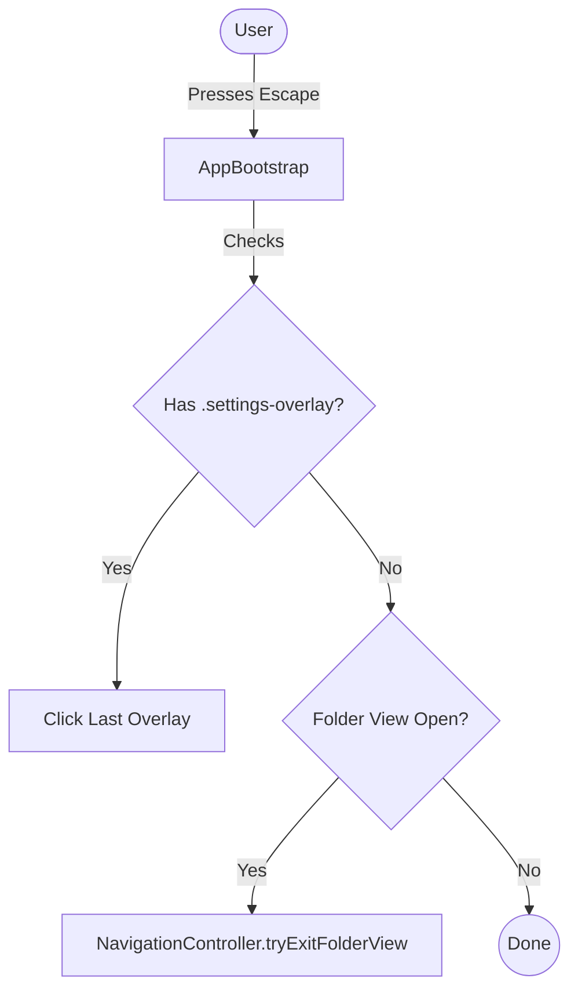

# Implementation Plan - Escape Key for Popups and Settings

Allow the Escape key to dismiss any open popups (indicated by the `.settings-overlay` class) and the folder settings view.

## Gist
We will implement a global keyboard listener for the "Escape" key in the `AppBootstrap` class. This listener will sequentially dismiss the most recently added popup overlay. If no popups are open, it will attempt to exit the folder settings view.

## Moving Parts
- **`AppBootstrap.ts`**: Centralized location for global application shortcuts. It has access to both the DOM and the `NavigationController`.
- **`NavigationController.ts`**: provides the `tryExitFolderView` method to safely exit the folder view.
- **`.settings-overlay`**: The common class used by all popup components (`About`, `Analytics`, `Rank`, `Settings`, etc.) to provide a dismissible backdrop.

## Proposed Changes

### 1. `src/AppBootstrap.ts`
- Add `_setupKeyboardShortcuts()` method.
- Add `_handleEscapeKey()` method.
- Call `_setupKeyboardShortcuts()` in `initialize()`.

#### `_setupKeyboardShortcuts()`
- Listen for `keydown` events on `document`.
- If key is `Escape`, call `_handleEscapeKey()`.

#### `_handleEscapeKey()`
- Query for all `.settings-overlay` elements.
- If results exist, take the last one and call `.click()` on it.
- Else if `this._appStateService.getIsFolderViewOpen()` is true, call `this._navigationController.tryExitFolderView()`.

## Verification Plan

### Automated Tests
- Create a new test in `src/__tests__/AppBootstrap.test.ts` (if it exists) or check existing tests.
- Actually, better to test the functionality via UI simulation if possible, or unit test the `_handleEscapeKey` logic.
- I'll check if `AppBootstrap.ts` has tests.

### Manual Verification
- Open "About" popup, press Escape -> Should close.
- Open "Visual Settings", press Escape -> Should close.
- Open "Folder Settings", press Escape -> Should close (if folder is valid).
- Open "Rank Popup", press Escape -> Should close.
- If multiple popups are open (if possible), Escape should close the top one first.
