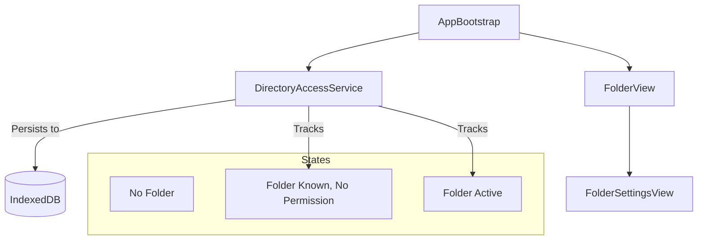
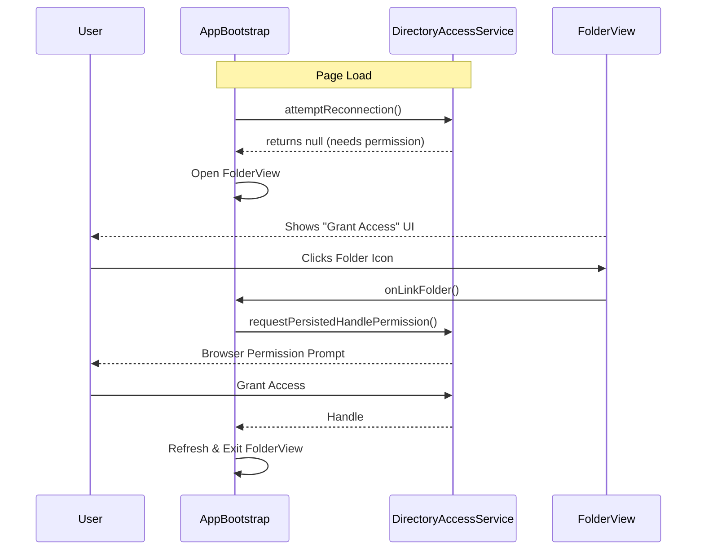

# Implementation Plan - Fix Folder Access Persistence Bug

## Gist
The application currently "forgets" folder access when the page is reloaded because the File System Access API requires re-granting permission for persisted handles. The app incorrectly treats a handle requiring permission as an "invalid" selection, leading to confusing "ERROR: TRY AGAIN" messages and forcing the user to re-select the folder. 

We will:
1.  **Enhance `DirectoryAccessService`** to track persisted handles even when permission is missing.
2.  **Add permission request logic** to `DirectoryAccessService` to reuse stored handles.
3.  **Update `FolderView` and `FolderSettingsView`** to recognize the "Needs Permission" state and provide a clear "Grant Access" UI instead of an error.
4.  **Wiring in `AppBootstrap`** to attempt re-granting permission when the user interacts with the folder view.

## Proposed Changes

### 1. `src/services/DirectoryAccessService.ts`
- Add `_persistedHandle: FileSystemDirectoryHandle | null` field.
- Update `attemptReconnection()` to store the handle in `_persistedHandle` even if `_verifyPermission` fails.
- Add `public hasPersistedHandle(): boolean`.
- Add `public async requestPersistedHandlePermission(): Promise<FileSystemDirectoryHandle | null>`.
- Add `public getPersistedHandleName(): string | null`.

### 2. `src/components/ui/FolderSettingsView.ts`
- Add `needsPermission?: boolean` to `FolderSettingsConfig`.
- Update `_createFolderIcon()` to show a different class/style when `needsPermission` is true.
- Update scrolling text logic: if `needsPermission` is true, show "PROMPT: GRANT ACCESS" instead of "ERROR: TRY AGAIN".
- Update instructions text to be more helpful if we already have a folder name.

### 3. `src/components/FolderView.ts`
- Pass `needsPermission` from `DirectoryAccessService` to `FolderSettingsView`.
- Refine `isInvalid` logic to exclude the `needsPermission` state.

### 4. `src/AppBootstrap.ts`
- In `_handleManualFolderSelection`, check if `directoryService.hasPersistedHandle()` is true.
- If true, try `requestPersistedHandlePermission()` first. If that fails or is denied, fall back to `requestDirectorySelection()`.

## Diagrams

### Component Relationship

### Permission Flow

