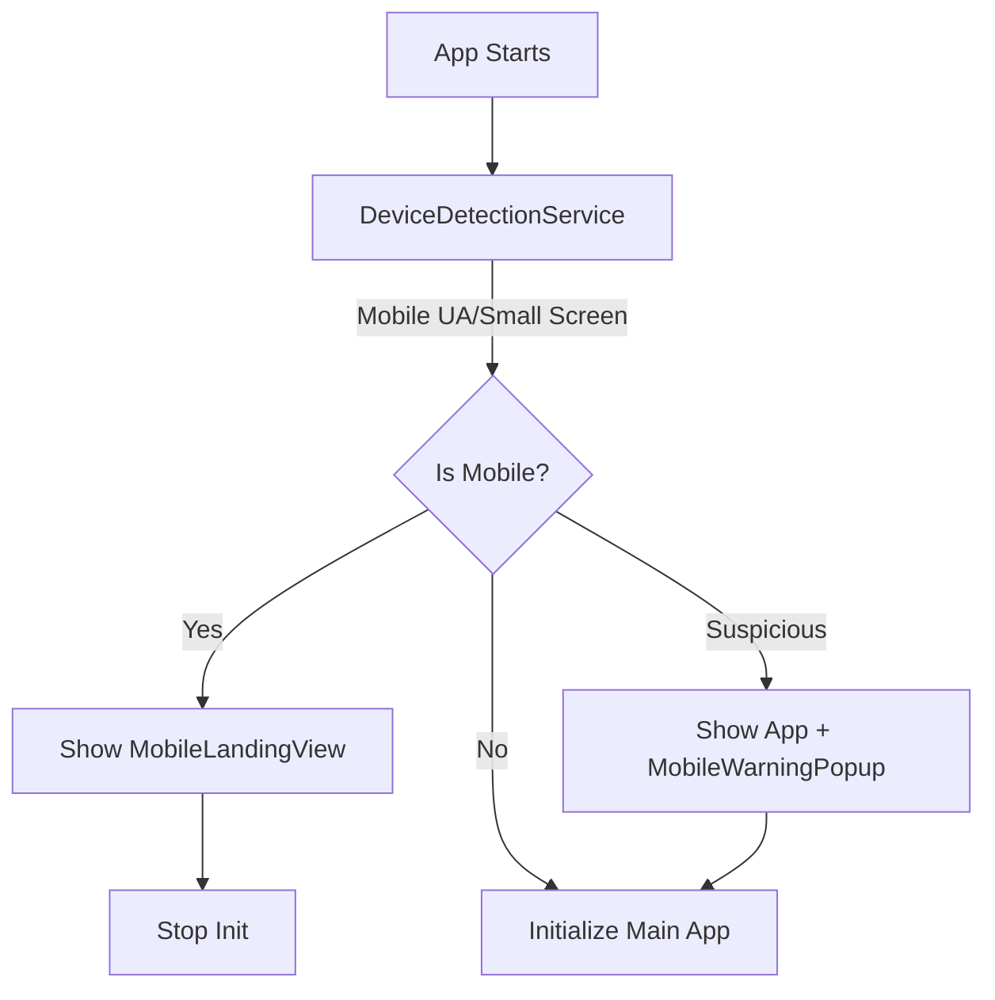
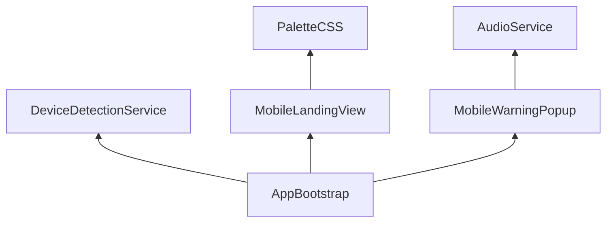

# Implementation Plan - Mobile Landing Page and Detection

## Gist
Implement a device-aware entry flow that handles mobile users gracefully. Since the application requires Kovaaks (desktop-only), mobile users will be redirected to a beautiful landing page explaining the limitation. If the device detection is ambiguous, users can still access the app but will receive a warning popup.

- **DeviceDetectionService**: Centralized logic for UA and viewport-based detection.
- **MobileLandingView**: A premium "Desktop Only" landing page for confirmed mobile devices.
- **MobileWarningPopup**: A subtle warning for "suspicious" devices that might be mobile.
- **AppBootstrap Integration**: Orchestrates the detection and determines which view to mount.

## Proposed Changes

### 1. DeviceDetectionService
Create `src/services/DeviceDetectionService.ts`.
- Detects based on `navigator.userAgent`.
- Detects based on screen dimensions and touch capabilities.
- Categorizes devices as `MOBILE`, `SUSPICIOUS`, or `DESKTOP`.

### 2. MobileLandingView
Create `src/components/MobileLandingView.ts`.
- Full-screen takeover with a premium design.
- Uses the project's color palette and "glassmorphism" aesthetic.
- Explains why the app is desktop-only (Kovaaks requirement).
- Includes links to social media/GitHub/Ko-fi to keep engagement.

### 3. MobileWarningPopup
Create `src/components/ui/MobileWarningPopup.ts`.
- A specialized popup using the existing `Overlay` system if possible, or a standalone component.
- Warns that the app is optimized for desktop and might not work well on mobile.

### 4. Style Enhancements
Update `index.html` or a new CSS file for mobile-specific styles:
- Hide the main `#app` container when the landing page is active.
- Premium styling for the landing page (vibrant gradients, smooth animations).

### 5. AppBootstrap Wiring
Modify `src/AppBootstrap.ts`:
- Call `DeviceDetectionService` early in `initialize()`.
- If `MOBILE`, render `MobileLandingView` and skip main app initialization.
- If `SUSPICIOUS`, render the main app but show `MobileWarningPopup`.

## Diagrams

### Device Detection Flow

### Component Structure

