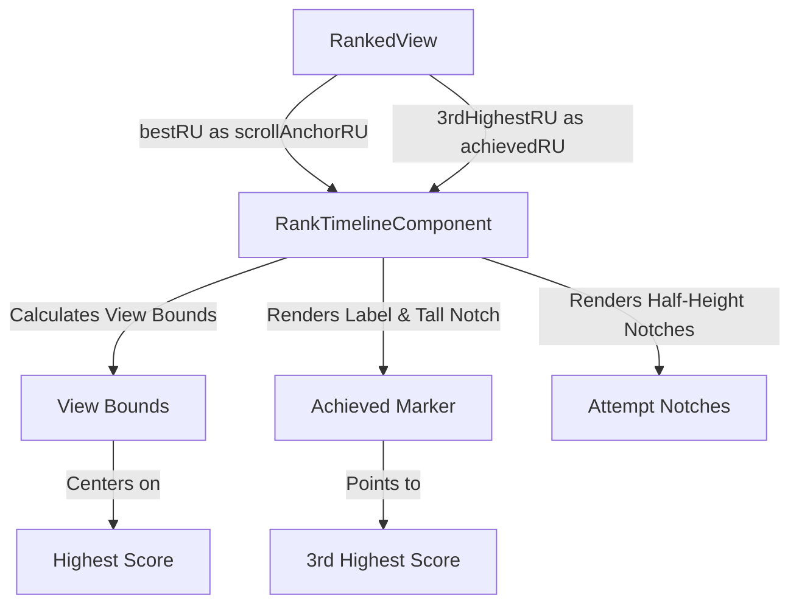

# Implementation Plan - Move "Achieved" Marker to 3rd Highest Score

This plan describes how to modify the ranked timeline visualization so that the "Achieved" label and its tall notch point to the third-highest score in the session, while the timeline's scroll position remains centered on the highest score achieved.

## Gist
The core idea is to decouple the "visual anchor" for the "Achieved" status from the "scroll anchor" for the timeline. Currently, both use the same `achievedRU` value. We will introduce a new `scrollAnchorRU` property to the `RankTimelineComponent` configuration to handle the scrolling logic separately.

- **RankTimelineComponent**: Updated to use `scrollAnchorRU` for view bounds calculation if provided, falling back to `achievedRU`.
- **RankedView**: Updated to calculate the 3rd highest score from the session's runs and pass it as the new `achievedRU`, while passing the true highest score as `scrollAnchorRU`.

## Proposed Changes

### 1. src/components/visualizations/RankTimelineComponent.ts

- Modify `RankTimelineConfiguration` interface to include `bestRU?: number`.
- Update `_calculateViewBounds()` to use `this._config.bestRU ?? this._config.achievedRU` as the scroll anchor.

### 2. src/components/RankedView.ts

- Update `_updateRankTimeline()` to calculate the 3rd highest RU and pass it to the `RankTimelineComponent` constructor.
- Update `_getScenarioPerformanceData()` (or inline) to retrieve the 3rd highest score from the session.

---

## Verification Plan

### Automated Tests
- Run existing tests to ensure no regressions: `npm run test`
- Specifically check `RankTimeline.test.ts` if it needs updates for the new configuration.

### Manual Verification
- Start a ranked session.
- Play 3 or more runs of a scenario.
- Observe:
    - The "Achieved" label and tall notch should be at the 3rd highest score's position.
    - The timeline should be scrolled/centered such that the highest score (the one with a half-height notch further to the right) is clearly visible and ideally centered.
    - If fewer than 3 runs are played, the "Achieved" label should point to the lowest of the available runs (e.g., the 2nd highest if only 2 runs, or the 1st highest if only 1 run).
