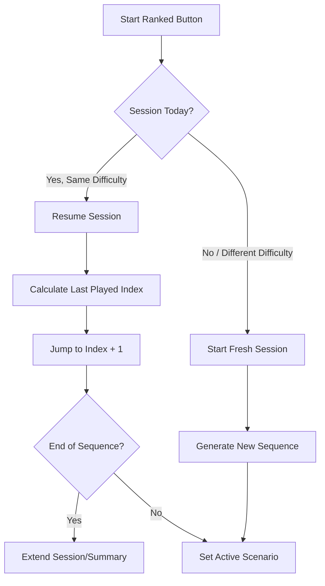

# Ranked Session Persistence and Resumption

## Gist
The goal is to allow users to resume their daily ranked session if they leave and come back later the same day.
- **Persistent Storage**: Ranked session state (sequence, played scenarios, difficulty) is kept in `localStorage` even after returning to the Hub.
- **Date Check**: Sessions are identified by their generation date to ensure a "Daily Run" resets only on a new day or new difficulty.
- **Smart Jumping**: When resuming, the app automatically jumps to the scenario immediately following the last one the user actually played.
- **Uninterrupted Flow**: If the user has already played the initial gauntlet, resumption automatically extends the session into the infinite run.

## Proposed Changes

### 1. RankedSessionService (`src/services/RankedSessionService.ts`)
- **Resumption Logic**: Updated `startSession` to recognize if a session for the target difficulty was already generated today.
- **Jump Mechanism**: Implemented `_resumeExistingSession` which scans the `_playedScenarios` set and moves `_currentIndex` to the next available slot.
- **State Preservation**: Modified `reset()` to stop active tracking while preserving the sequence and progress data in `localStorage`.

### 2. Testing (`src/services/__tests__/RankedSessionServiceResumption.test.ts`)
- Added comprehensive tests for:
    - Same-day resumption with scenario jumping.
    - Back button functionality after resumption.
    - Fresh start for different difficulties.
    - Automatic extension when jumping past the initial gauntlet.

## Impact
- Users can safely leave the app or go to the hub without losing their place in the daily ranked run.
- Completed scenarios are not repeated when re-entering the session.
- The "Daily Run" concept is reinforced by persisting the sequence for the entire day.
