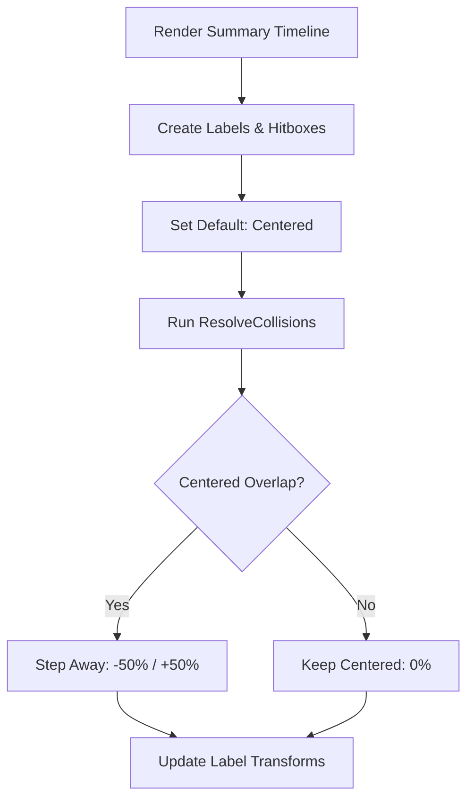

# Summary Timeline Layout Fix

The implementation aims to resolve a bug where ranked summary screen anchors and hitboxes were misaligned vertically, and labels were not correctly centered when no overlaps occurred.

## Gist

The goal is to ensure that rank labels in the end-of-session summary are perfectly centered on their respective timeline notches by default, and only shift away if a collision is detected. Additionally, the invisible hitboxes used for collision detection must exactly match the labels' vertical positioning and typography to ensure accurate calculations.

## Proposed Changes

### 1. `SummaryTimelineComponent.ts`
- Change the default `translateX` for all summary labels from directional (50%/-50%) to centered (0%).
- Update the `_resolvePair` collision logic:
    - Base state is now centered.
    - If hitboxes (centered by default) overlap, the labels will "step away" from each other using `-50%` (for the left label) and `+50%` (for the right label).
- Ensure the hitboxes themselves explicitly match the label transforms during the measurement phase if necessary, though keeping them at 0% and using them as the "centered" reference is preferred.

### 2. `src/styles/components.css`
- Apply `margin-top: 1rem` to hitboxes within bottom anchors to match the `summary-timeline-rank-label` positioning.
- Synchronize typography between labels and hitboxes, specifically fixing the `letter-spacing` for the title hitbox.
- Ensure hitboxes are correctly layered relative to anchors.

## Verification Plan

### Automated Tests
- Run existing tests to ensure no regressions in rank calculations or timeline rendering.
- `npm run test`

### Manual Verification
- Open the ranked summary screen.
- Verify that scenario names and rank labels are centered on their notches when ample space exists.
- Resize the window to force collisions and verify that labels smoothly shift to their "stepped away" positions.
- Use browser dev tools to inspect hitbox positions (by temporarily removing `visibility: hidden`) and ensure they match the labels perfectly.
