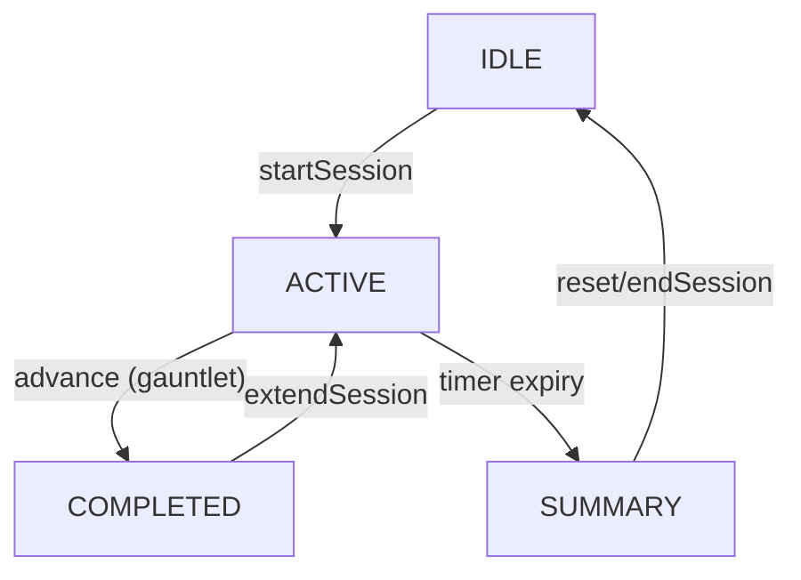

# Implementation Plan - Ranked Session Auto-End and Review UI

Currently, a ranked session does not end when its timer runs out. This plan outlines the changes needed to make the session end automatically and display a summary review UI.

## Gist
The goal is to provide a sense of closure to ranked runs by automatically ending them when the allocated time (e.g., 60 minutes) is up. This involves:
- **Timer Monitoring**: `RankedSessionService` will track the session time and transition to a `SUMMARY` state when the limit is reached.
- **New State**: A `SUMMARY` status will be added to `RankedSessionStatus`.
- **Review UI**: `RankedView` will render a new summary screen showing the final results of the run.

## Proposed Changes

### 1. Model and Service Updates

#### `src/services/RankedSessionService.ts`
- **Status Change**: Add `SUMMARY` to `RankedSessionStatus`.
- **Dependency**: Inject `SessionSettingsService` to access `rankedIntervalMinutes`.
- **Timer Logic**:
    - Start a `setInterval` when a session starts.
    - Periodically check if `elapsedSeconds >= totalSeconds`.
    - If expired, set status to `SUMMARY` and notify listeners.
- **New Getter**: `remainingSeconds` to easily check how much time is left.

### 2. UI Updates

#### `src/components/RankedView.ts`
- **Render SUMMARY**: Add logic to handle the `SUMMARY` state.
- **Review UI**: Create `_renderSummaryContent()` which displays:
    - "RUN COMPLETE" header.
    - Final achieved rank.
    - A list of scenarios played during this session and their best scores/ranks.
    - "BACK TO HUB" button to return to IDLE.
- **Update Play Button**: Ensure the "drain" animation is consistent with the service's timer, though the current CSS animation is already quite good.

### 3. Verification Plan

#### Automated Tests
- **Unit Test**: `RankedSessionService.test.ts`
    - Verify that starting a session starts the timer.
    - Verify that after the interval passes, the state becomes `SUMMARY`.
    - Verify that `remainingSeconds` counts down.
- **UI Test**: (If applicable)
    - Check that the summary UI appears when the session ends.

#### Manual Verification
- Start a ranked run.
- Set the timeout to a very short value (e.g., 1 minute) in settings.
- Wait for the timer to expire.
- Confirm the summary screen appears and shows correct data.
- Confirm clicking "BACK TO HUB" returns to the idle state.
