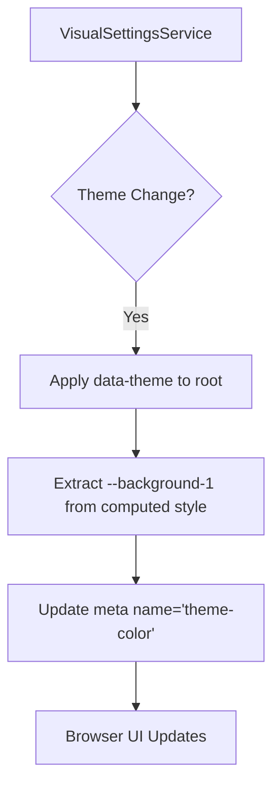
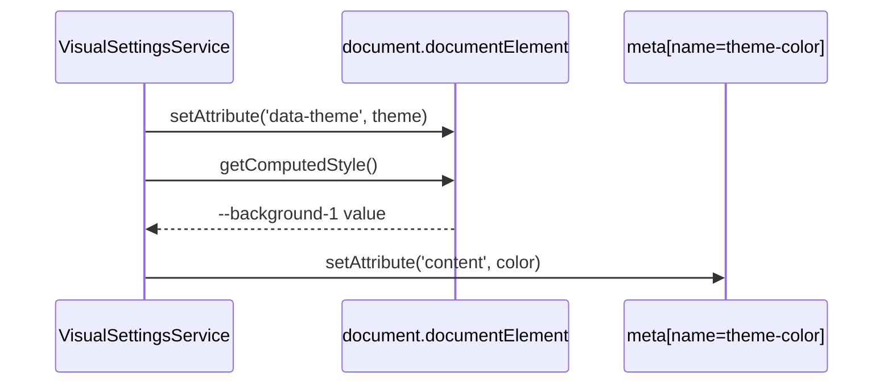

# Implementation Plan - Eliminating Hardcoded Colors in HTML Head

The overarching goal is to remove hardcoded hex values from the `index.html` head and consolidate theme management within the `VisualSettingsService`. This ensures that the browser's UI elements (like the address bar) stay synchronized with the application's selected theme while maintaining a single source of truth for colors in `palette.css`.

## Gist
The plan involves moving the responsibility of setting the `theme-color` meta tag from static HTML to dynamic TypeScript logic. By querying the computed styles of the application's root element, we can extract the current theme's background color and apply it to the browser's environment automatically.

- **`VisualSettingsService`**: Updated to manage the `theme-color` meta tag dynamically.
- **`index.html`**: Hardcoded hex values are removed in favor of dynamic initialization.
- **`palette.css`**: Remains the single source of truth for all color values.



---

## Proposed Changes

### 1. Enhance `VisualSettingsService`

We will modify the `VisualSettingsService` to include a private method that synchronizes the document's meta tags with the current visual state.

- Update `_applyCssVariables` to call a new `_syncThemeColorMeta` method.
- The new method will find (or create) the `theme-color` meta tag and update its `content` attribute.

### 2. Clean up `index.html`

We will remove the lines:
```html
<meta name="theme-color" content="#020203" media="(prefers-color-scheme: dark)" />
<meta name="theme-color" content="#f4f7ee" media="(prefers-color-scheme: light)" />
```
And replace them with a single placeholder or just let the service handle it entirely.

---

## Detailed Steps

### Step 1: Update `VisualSettingsService`

Modify `src/services/VisualSettingsService.ts` to include the logic for updating the `theme-color` meta tag.



### Step 2: Update `index.html`

Remove the hardcoded meta tags to ensure no stale colors are flashed before the service initializes.

---

## Verification Plan

### Automated Tests
- No specific automated tests required for the meta tag update, as it's a browser integration feature, but we will ensure the service still passes its existing tests.
- We can add a simple unit test to `VisualSettingsService.test.ts` to verify it attempts to find and update the meta tag.

### Manual Verification
- Open the application in a browser (e.g., Chrome on Android or Safari on iOS/macOS).
- Toggle between Light and Dark modes.
- Verify that the browser's address bar or title bar color changes to match the application's background.
- Inspect the `<head>` in DevTools to confirm the `theme-color` meta tag is being updated dynamically.
