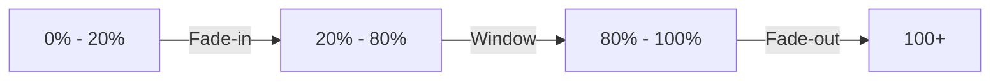
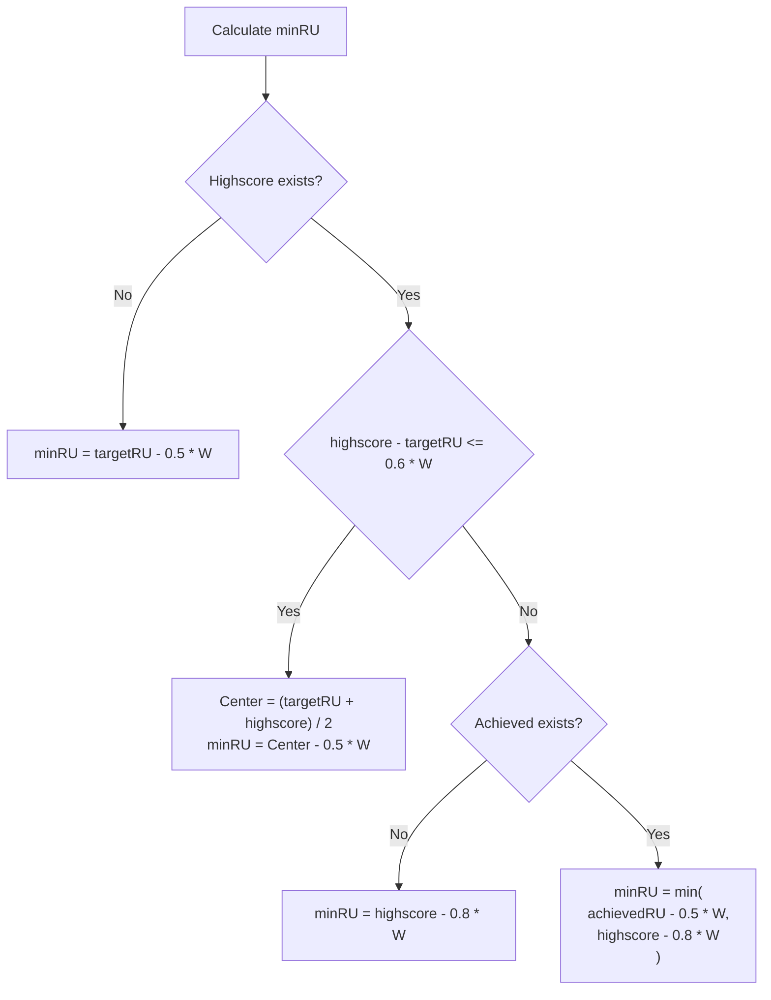
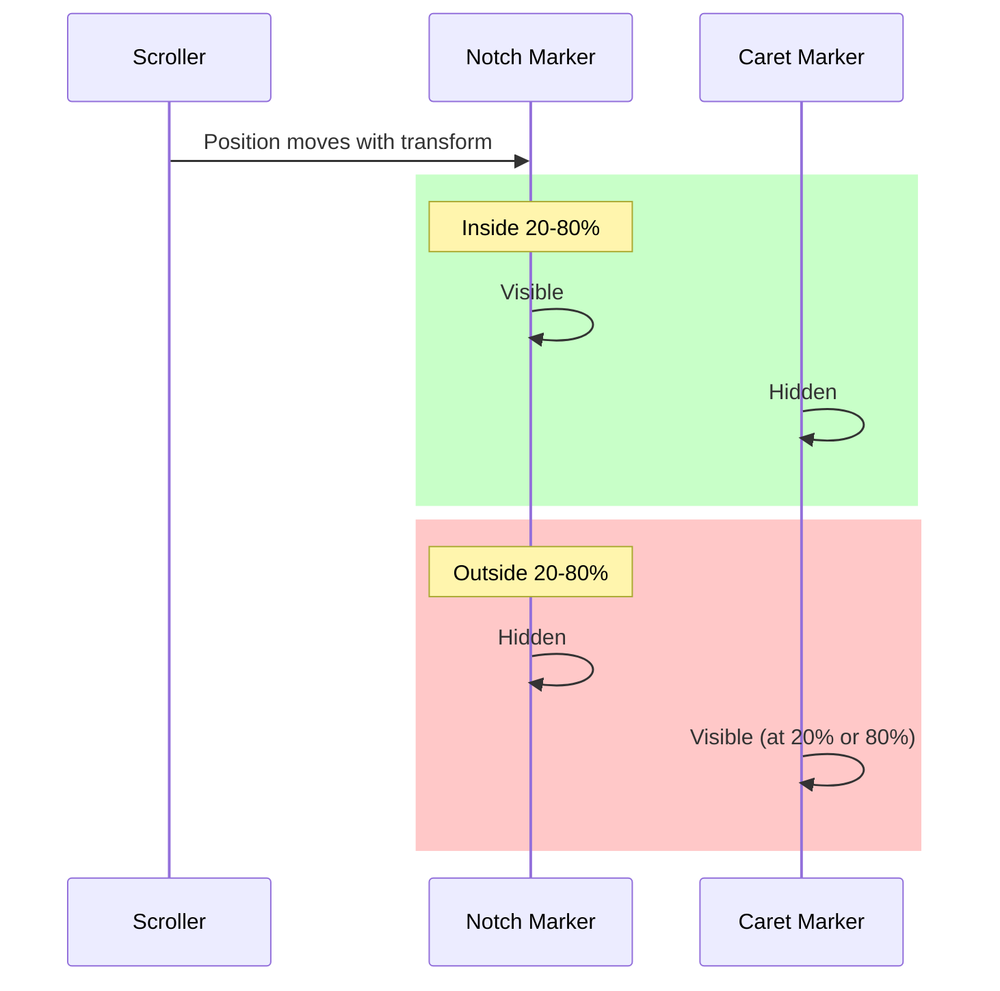

# Implementation Plan - Ranked Session Timeline Scroll Overhaul

## Gist
The goal is to overhaul the `RankTimelineComponent` to adhere to strict visual and functional requirements. This includes redefining the "Window" (the active visible area) as the middle 60% of the container, implementing a precise scrolling algorithm for centering and alignment, and ensuring that labelled notches correctly transition between their notch and caret versions based on their real-time position during animations.

Key components of the plan:
- **Window Redefinition**: Set the Window boundaries to 20% and 80% marks.
- **Scroll Algorithm**: Implement logic for centering targets, symmetrical centering for target+highscore, and edge-alignment fallbacks.
- **Dynamic Carets**: Ensure carets adapt to scroll animations by tracking real-time positions.
- **Progress Line**: Implement a 2s animation that starts from the target or the left edge of the container if the target is offscreen.

---

## Technical Details

### 1. Window and Masking
The "Window" is defined as the middle 60% of the anchor parent width (0.6 * width). Centered, this means from **20%** to **80%**.
The CSS mask should be updated to reflect this, providing a fade outside the Window.

### 2. Scroll Position Algorithm
The `_calculateViewBounds` method will be rewritten to determine the `minRU` (left edge of the view) based on the following precedence:

1.  **Only Target**: Center `targetRU` at the 50% mark.
2.  **Target + Highscore Fit**: If `highscore - targetRU <= 0.6 * windowSize`, center them symmetrically about the 50% mark.
3.  **Does Not Fit**:
    - If no `achievedRU` (only highest score): Align `highscore` to the 80% mark.
    - If `achievedRU` present: Set `minRU` to the leftmost position between "Align highest score to 80%" and "Center achieved notch at 50%".

### 3. Dynamic Caret Logic
Labelled notches (`target`, `achieved`) will be rendered such that they toggle between a **notch** (when between 20-80%) and a **caret** (when outside 20-80%).
To handle animations, we will implement a `_syncMarkers` method that updates visibility/classes based on real-time screen positions.

### 4. Progress Line Animation
The 2s progress line animation will start from the target position if it's visible within the anchor parent (0-100%), otherwise it starts from the left edge (0%).

---

## Step-by-Step Implementation

### Step 1: Update Styles and Constants
- Update `.timeline-viewport` mask in `components.css`.
- Update caret and label constants in `RankTimelineComponent.ts` to use 20%/80%.

### Step 2: Rewrite Scroll Algorithm
- Update `_calculateViewBounds` in `RankTimelineComponent.ts`.
- Calculate `highscore` as `max(achievedRU, expectedRU, attemptsRU)`.

### Step 3: Implement Dynamic Marker Sync
- Modify `_renderMarkers` to prepare both notch and caret versions (or a structure that can toggle).
- Add `_syncMarkers` and call it during the 1s scroll animation using `requestAnimationFrame`.

### Step 4: Update Progress Line Logic
- Modify `_renderProgressLine` and `_renderInitialProgress` to handle the "starting from left edge" requirement.
- Verify transition durations (1s scroll, 2s progress line).

### Step 5: Final Polish and Testing
- Verify all labels and carets work correctly during rapid updates and animations.
- Ensure collisions are still resolved for the on-screen notches.
