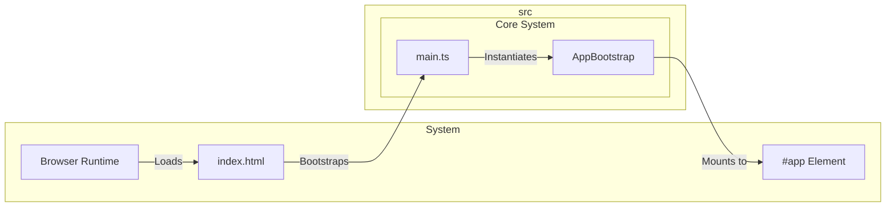
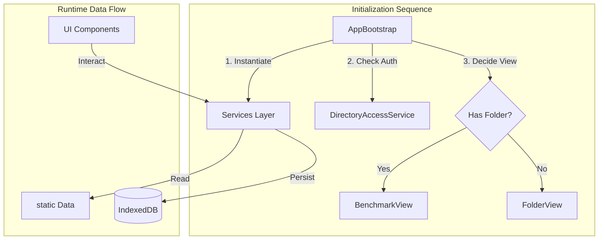

# External Documentation

## External Interactions Diagram

## Exposed Internal API

### `main.ts`
The standard Vite entry point. It imports global styles and initializes the `AppBootstrap`.

### `AppBootstrap.ts`
The main application orchestrator. It is responsible for:
1.  **Service Initialization**: Instantiating all singleton services (e.g., `SessionService`, `RankedSessionService`).
2.  **Dependency Injection**: Manually injecting dependencies into services and components (Pure DI).
3.  **Root View Mounting**: determining which view to show initially (usually `FolderView` or `BenchmarkView` depending on persistence state) and attaching it to the DOM.
4.  **Global Event Listeners**: Setting up app-wide handlers (e.g., window resize, visibility change).

# Internal Documentation

## Internal Interactions Diagram

The application follows a strict initialization sequence managed by `AppBootstrap`.

## Internal Files and API

- `components/`: UI views and controllers.
- `services/`: Business logic and state management.
- `data/`: Static configuration data (benchmarks, scenarios).
- `utils/`: Shared utility functions (PRNG, helpers).
- `styles/`: Global CSS and design tokens.
- `types/`: TypeScript type definitions.
- `assets/`: Static assets (images, fonts).
