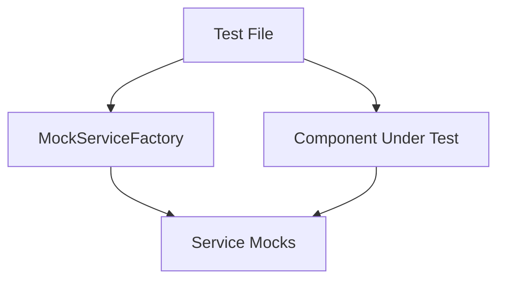

# Component Tests Documentation

This directory contains Vitest-based unit and integration tests for the UI components of the application.

## Test Infrastructure

To ensure consistency and reduce boilerplate, tests should utilize the centralized mock factory.

### Key Utilities

- **MockServiceFactory**: A centralized class for creating standard, composable mocks for services like `BenchmarkService`, `RankEstimator`, and `AppStateService`.
- **_waitForSelector**: A helper function to wait for elements to appear in the JSDOM, essential for async rendering cycles.

## Component Relationships in Tests



## Abstracting Test Logic

As per the "Abstraction and Composition" principle, repetitive test setup and assertion logic should be extracted into helper functions (prefixed with `_`) within the test file or moved to a shared utility if used across multiple files.

### Example Refactoring

Before:
```typescript
it("should test something", () => {
    const dep1 = { ... };
    const dep2 = { ... };
    const view = new View(dep1, dep2);
    // ... many lines of DOM setup
});
```

After:
```typescript
it("should test something", async () => {
    const deps = MockServiceFactory.createViewDependencies();
    const view = await _mountView(deps);
    _assertCorrectState(view);
});
```
