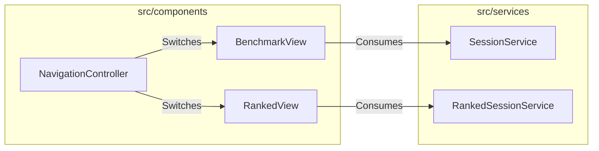
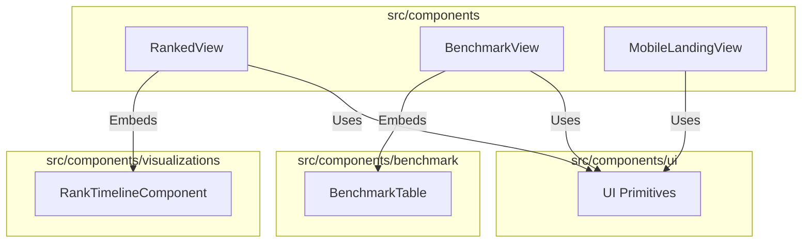

# External Documentation

## External Interactions Diagram

## Exposed Internal API

### `RankedView`
The core terminal-style interface for the "Ranked Run" experience. It manages the sequence of scenarios, the timer, and the final session summary.
- **Relies on**: `RankedSessionService`, `RankTimelineComponent`, `NavigationController`

### `BenchmarkView`
The dashboard interface showing historical performance across all scenarios.
- **Relies on**: `SessionService`, `BenchmarkService`, `BenchmarkTable`

### `NavigationController`
Manages the transitions between different views (e.g., from Benchmark to Ranked).

### `MobileLandingView`
The initial landing screen for mobile users, directing them to desktop for the full experience or providing limited mobile functionality.

# Internal Documentation

## Internal Interactions Diagram

## Internal Files and API

- `benchmark/`: Specific components for the benchmark table and scenario lists.
- `ui/`: Reusable primitive UI components like buttons, tooltips, and layouts.
- `visualizations/`: Specialized data visualization components (see `visualizations/_docs.md`).
