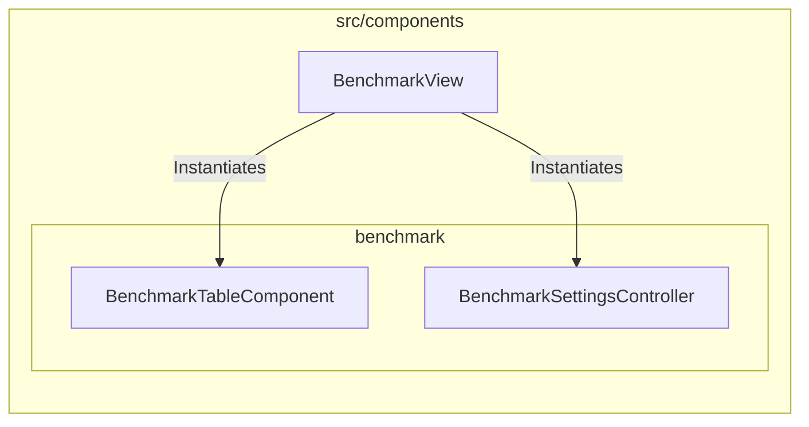
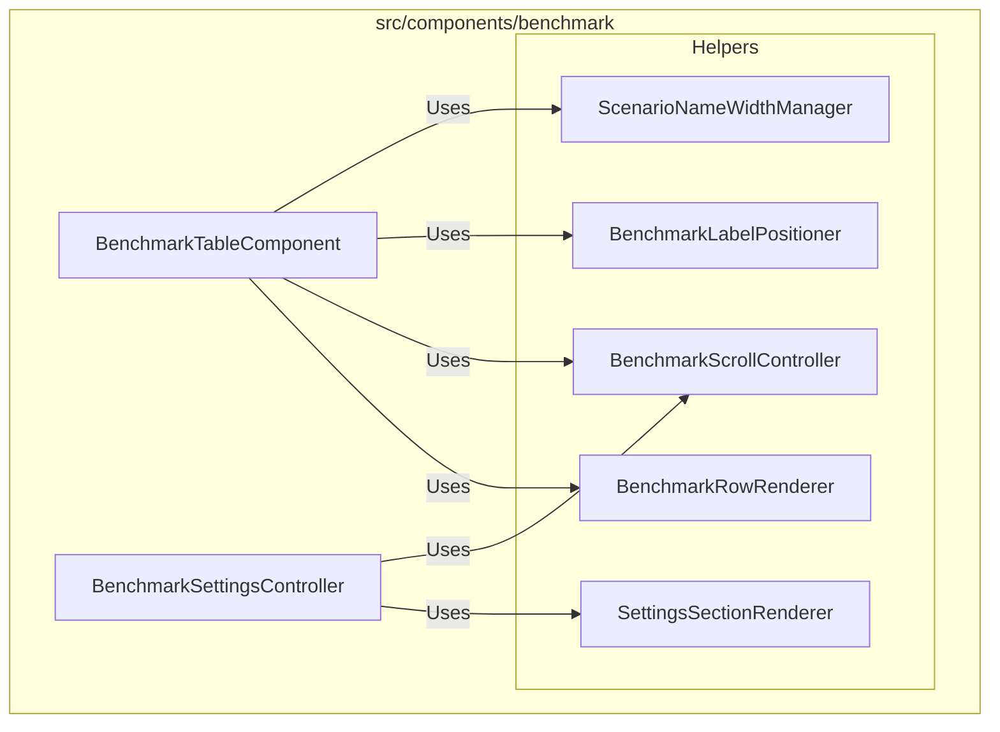

# External Documentation

## External Interactions Diagram

## Exposed Internal API

### `BenchmarkTableComponent`
The primary sub-view for the benchmark dashboard. It renders a scrollable list of scenarios, grouped by category and subcategory.
- **Features**: Custom scrollbar, dynamic label positioning, focus management.

### `BenchmarkSettingsController`
Manages the "Settings" overlay specific to the benchmark view. It connects the `SettingsUiFactory` with the various service layers to toggle preferences (e.g., Audio, Themes, Dot Cloud visibility).

# Internal Documentation

## Internal Interactions Diagram

## Internal Files and API

### `BenchmarkRowRenderer`
Responsible for the DOM creation and updating of individual scenario rows. It handles the complexity of rendering rank tiers, scores, and progress bars.

### `BenchmarkScrollController`
Implements a custom scrollbar logic (handled via `custom-scroll-thumb` and `match-heights`) to replace the default browser scrollbar for a stylized look. Used by both the main table and the settings menu.

### `BenchmarkLabelPositioner`
A specialized utility that keeps category and subcategory labels stuck to the edge of the viewport or centered relative to their content group as the user scrolls.

### `ScenarioNameWidthManager`
Ensures all scenario names across the table share a consistent width, aligning columns dynamically based on the longest name in the current difficulty set.

### `SettingsSectionRenderer`
A helper class for `BenchmarkSettingsController` that encapsulates the logic for building specific sections of the settings menu (e.g., Audio, Layout, Elements).
