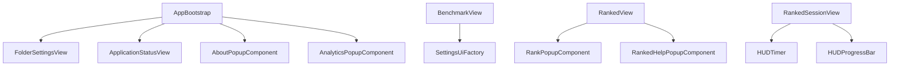

# UI Components

This directory contains standalone UI components for the Raw Output application. These components are primarily responsible for rendering complex UI elements like popups, status views, and specialized HUD elements.

## API Overview

The components in this directory follow a pattern where they are instantiated with required services and then rendered into the DOM.

- `AboutPopupComponent`: Renders an informational popup about the application.
- `AnalyticsPopupComponent`: Prompts the user for score feedback consent.
- `ApplicationStatusView`: Manages the application-wide status indicator (e.g., Connected, Scanning).
- `FolderSettingsView`: A full-screen view for managing the Kovaak's stats folder link.
- `HUDProgressBar`: A reusable progress bar for HUD elements.
- `HUDTimer`: A timer component for tracking session duration.
- `RankPopupComponent`: Displays detailed rank information and progress.
- `RankedHelpPopupComponent`: Shows help and instructions for the Ranked mode.
- `SettingsUiFactory`: A static utility for creating standardized settings UI elements (toggles, sliders, etc.).

## Relationships

## Implementation Details

Most popups use the `settings-overlay` and `settings-menu-container` classes for a consistent glassmorphic look. Components that require interaction sounds use the `AudioService`. Standardized settings elements are built via `SettingsUiFactory` to ensure visual consistency across the app.
