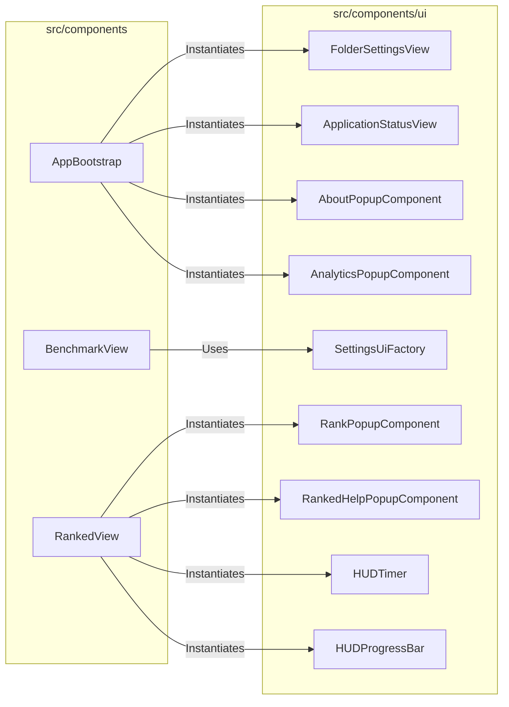
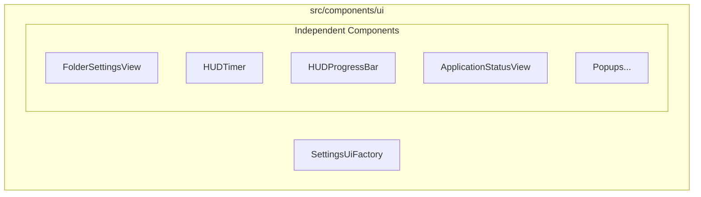

# External Documentation

## External Interactions Diagram

## Exposed Internal API

- `AboutPopupComponent`: Renders an informational popup about the application.
- `AnalyticsPopupComponent`: Prompts the user for score feedback consent.
- `ApplicationStatusView`: Manages the application-wide status indicator (e.g., Connected, Scanning).
- `FolderSettingsView`: A full-screen view for managing the Kovaak's stats folder link.
- `HUDProgressBar`: A reusable progress bar for HUD elements.
- `HUDTimer`: A timer component for tracking session duration.
- `MobileWarningPopup`: A popup warning displayed when a user attempts to access desktop-only features on a mobile device.
- `PeakWarningPopupComponent`: A popup alerting the user when their performance deviates significantly from their peak, suggesting potential issues.
- `RankPopupComponent`: Displays detailed rank information and progress.
- `RankedHelpPopupComponent`: Shows help and instructions for the Ranked mode.
- `SettingsUiFactory`: A static utility for creating standardized settings UI elements (toggles, sliders, etc.).

# Internal Documentation

## Internal Interactions Diagram

## Internal Files and API

Most popups use the `settings-overlay` and `settings-menu-container` classes for a consistent glassmorphic look. Components that require interaction sounds use the `AudioService`. Standardized settings elements are built via `SettingsUiFactory` to ensure visual consistency across the app.
