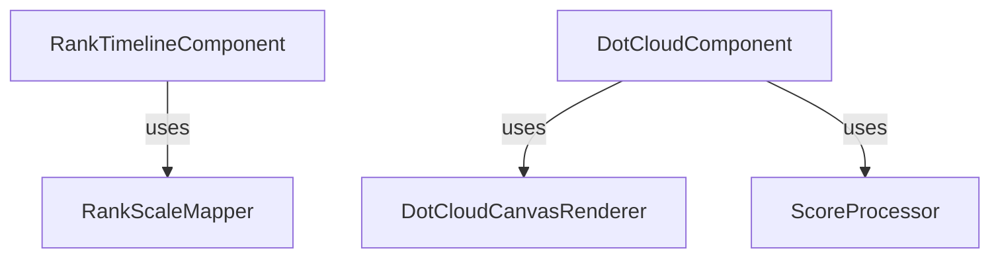
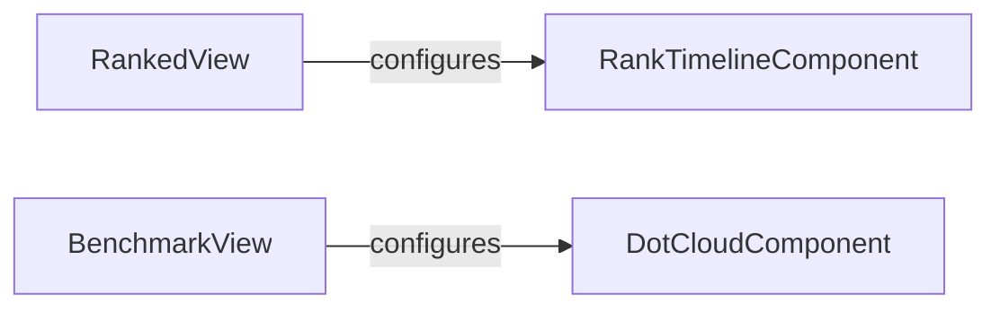

# Visualizations Documentation

This directory contains specialized UI components for data visualization, specifically focused on performance metrics and rank progression.

## Components

### `RankTimelineComponent`
A visualization of where a score or set of scores sits on a rank timeline. It shows historical "Achieved" marks, "Target" marks, and individual attempts as a cloud of dots.
- **Inputs**: `RankTimelineConfiguration` (thresholds, achieved/target/attempts RU, visual settings)
- **Features**: Collision resolution for overlapping labels, view window clamping, and offscreen target indicators.

### `DotCloudComponent`
A complex visualization of many score attempts over time or across scenarios. It uses canvas-based rendering for performance.
- **Relies on**: `DotCloudCanvasRenderer`, `ScoreProcessor`

### `RankScaleMapper`
A utility for mapping raw scores to a linear "Rank Unit" (RU) scale. This allows consistent spacing on a timeline regardless of non-linear threshold values.

### `ScoreProcessor`
A utility for preparing and filtering raw run data for visualization.

## Relationships

The `RankTimelineComponent` is primarily used by the `RankedView` to show progression during a ranked session. It depends on `RankScaleMapper` to translate game scores into a linear visual space.
