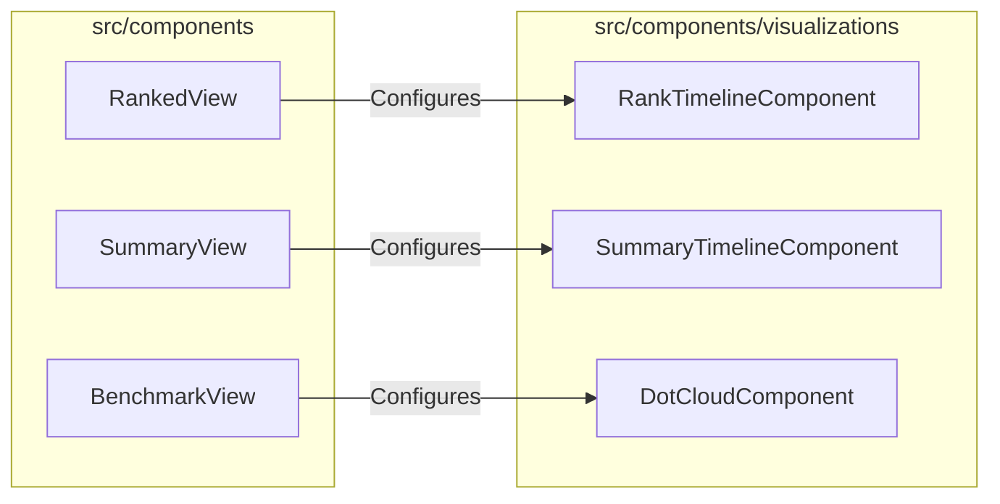
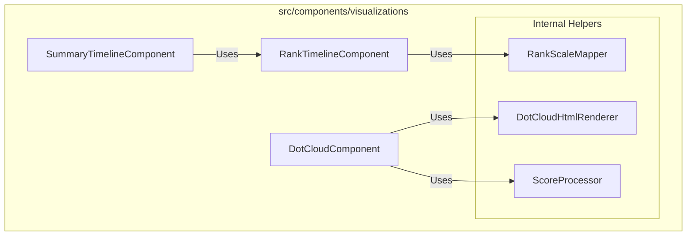

# External Documentation

## External Interactions Diagram

## Exposed Internal API

### `RankTimelineComponent`
A visualization of where a score or set of scores sits on a rank timeline. It shows historical "Achieved" marks, "Target" marks, and individual attempts.
- **Inputs**: `RankTimelineConfiguration` (thresholds, achieved/target/expected/attempts RU, visual settings)

### `SummaryTimelineComponent`
A specialized timeline used in the post-session summary to show the final result of the ranked session, often including rank evolution animations.
- **Relies on**: `RankTimelineComponent` (logic/rendering patterns), `RankedSessionService`

### `DotCloudComponent`
A complex visualization of many score attempts over time or across scenarios. It uses HTML-based rendering for improved debuggability and accessibility.
- **Relies on**: `DotCloudHtmlRenderer`, `ScoreProcessor`

# Internal Documentation

## Internal Interactions Diagram

## Internal Files and API

### `RankScaleMapper`
A utility for mapping raw scores to a linear "Rank Unit" (RU) scale. This allows consistent spacing on a timeline regardless of non-linear threshold values.

### `ScoreProcessor`
A utility for preparing and filtering raw run data for visualization.

### `DotCloudHtmlRenderer`
Handles the low-level HTML string generation for the Dot Cloud visualization.

The `RankTimelineComponent` features:
- **60% Window**: A clearly visible central area (20-80% of width) for focus.
- **Dynamic Scroll Algorithm**: Symmetrical centering for target/highscore, or edge-alignment fallbacks.
- **Dynamic Carets**: Labelled notches automatically transition to caret versions when outside the active Window, even during animations.
- **Collision Resolution**: Shifting overlapping labels to ensure readability.
