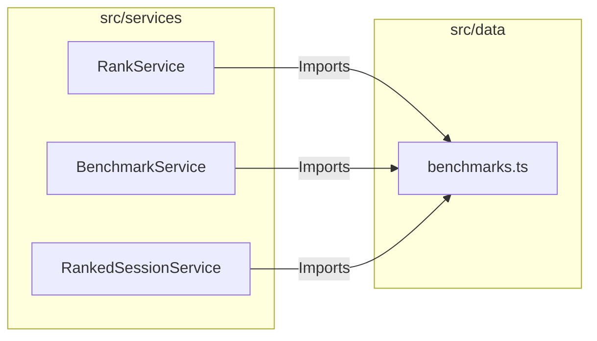

# External Documentation

## External Interactions Diagram

## Exposed Internal API

### `benchmarks.ts`
Contains the hardcoded definitions for the Ranked Mode mechanics and Benchmark tracking.
- **Scenarios**: The list of supported Kovaak's scenarios.
- **Thresholds**: Score requirements for each rank (Gold, Platinum, etc.).
- **Categories**: Groupings of scenarios (Clicking, Tracking, Switching).
- **Difficulties**: Configuration for different skill tiers (Novice, Intermediate, Advanced).

# Internal Documentation

## Internal Files and API

(None - Logic is purely static configuration)
