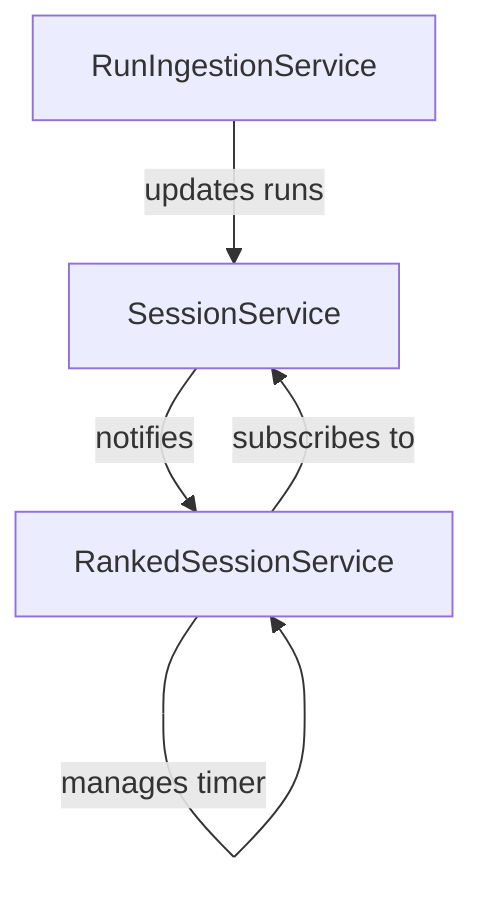

# Services Documentation

The `services` folder contains the core business logic of the application. These services are responsible for managing state, processing data, and orchestrating interactions between different components.

## Core Services

### `SessionService`
Manages the lifecycle of a training session. It tracks the best scores achieved within the current session window and handles session expiration.
- **Relies on**: `RankService`, `SessionSettingsService`
- **Used by**: `RankedSessionService`, `RunIngestionService`

### `RunIngestionService`
Orchestrates the ingestion of CSV performance data from the local file system. It detects new runs and populates them into the `SessionService`.
- **Relies on**: `DirectoryAccessService`, `KovaaksCsvParsingService`, `HistoryService`, `SessionService`, `BenchmarkService`

### `RankedSessionService`
Manages the "Ranked Run" experience, which includes a guided sequence of scenarios and a timed session.
- **Relies on**: `BenchmarkService`, `SessionService`, `RankEstimator`, `SessionSettingsService`

## Relationships

The `RankedSessionService` listens for updates from the `SessionService`. When new scores are recorded (detected by `RunIngestionService` and registered in `SessionService`), the `RankedSessionService` resets its internal run timer to the maximum allowed duration.
