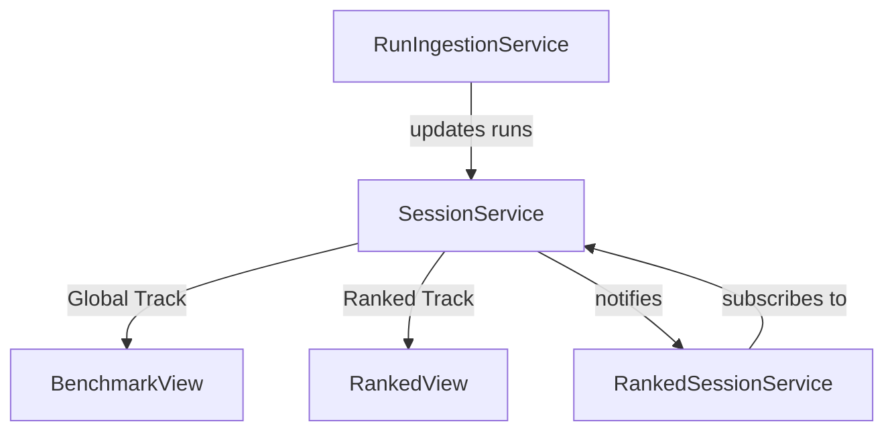

# Services Documentation

The `services` folder contains the core business logic of the application. These services are responsible for managing state, processing data, and orchestrating interactions between different components.

## Core Services

### `SessionService`
Manages the lifecycle of a training session. It maintains dual tracks: a **Global Track** for all runs in the current session window, and a **Ranked Track** for data recorded specifically during high-stakes ranked runs.
- **Relies on**: `RankService`, `SessionSettingsService`
- **Used by**: `RankedSessionService`, `RunIngestionService`

### `RunIngestionService`
Orchestrates the ingestion of CSV performance data from the local file system. It detects new runs and populates them into both the Global and Ranked tracks of `SessionService` as appropriate.
- **Relies on**: `DirectoryAccessService`, `KovaaksCsvParsingService`, `HistoryService`, `SessionService`, `BenchmarkService`

### `RankedSessionService`
Manages the "Ranked Run" experience, which includes a guided sequence of scenarios and a timed session. It consumes data exclusively from the Ranked track of `SessionService`.
- **Relies on**: `BenchmarkService`, `SessionService`, `RankEstimator`, `SessionSettingsService`

## Relationships

The `RankedSessionService` listens for updates from the `SessionService`. When new scores are recorded, the `RankedSessionService` resets its internal run timer. It ensures that the `RankedView` only shows improvements made within the context of an active ranked run.
