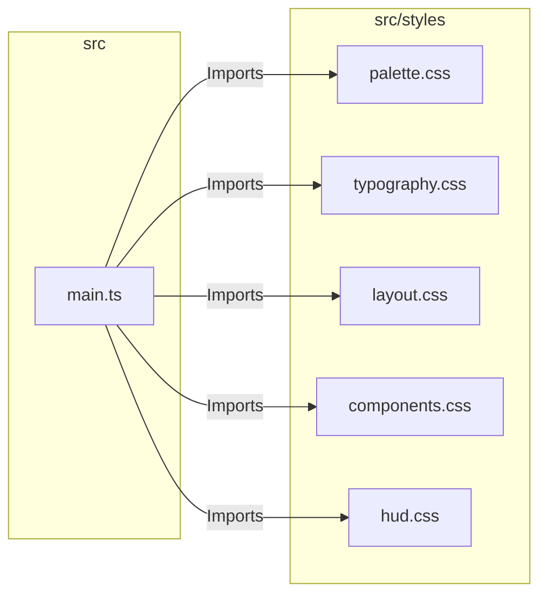
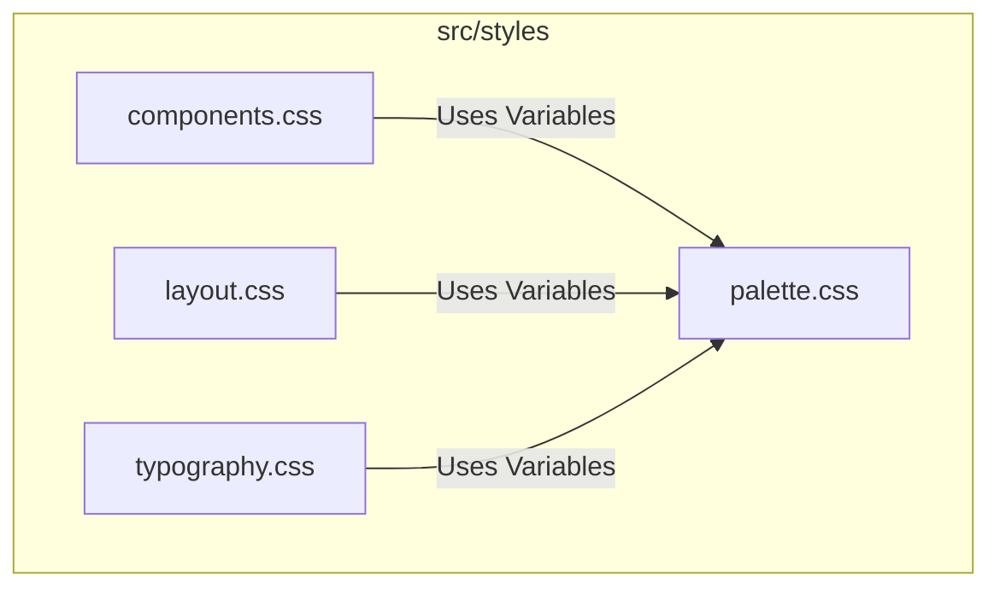

# External Documentation

## External Interactions Diagram

## Exposed Internal API

### Design Tokens (`palette.css`)
Defines the CSS Custom Properties (Variables) that control the application's look and feel.
- **Colors**: Semantic naming (e.g., `--primary-color`, `--surface-1`).
- **Gradients**: Standardized gradients for rank tiers and UI backdrops.
- **Themes**: Supports light/dark mode switching via attribute selectors on `:root`.

### Typography (`typography.css`)
Sets up the font stack, global text styles, and heading hierarchy.
- **Font**: "Outfit" (Google Font).
- **Scale**: Standardized font-sizes and line-heights.

### Layout Utilities (`layout.css`)
Provides global layout classes and resets.
- **Flexbox/Grid**: Utility classes for centering and spacing.
- **Containers**: Standard page padding and max-widths.

# Internal Documentation

## Internal Interactions Diagram

## Internal Files and API

### `palette.css`
The foundation of the design system. MUST be imported first. It defines `:root` variables.

### `typography.css`
Applies base styles to `body`, `h1-h6`, and generic text elements.

### `layout.css`
Handles high-level structure.
- `.pane-container`: A standard container for main application views.
- `.hidden-view`: Utility for efficiently hiding views without detaching them from DOM.

### `components.css`
Styles for shared non-primitive components (like buttons, inputs) that don't have their own encapsulated styles.
- **Buttons**: `.action-button`, `.secondary-button`.
- **Inputs**: `.global-input`.

### `hud.css`
Specific styles for the Heads-Up Display overlays used in Ranked Mode.
