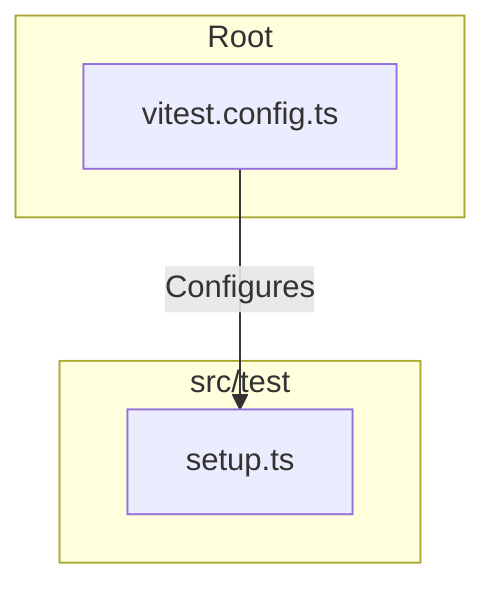
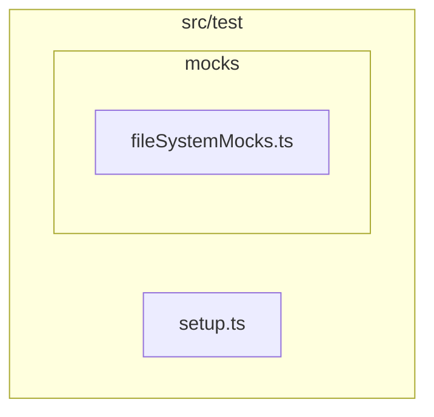

# External Documentation

## External Interactions Diagram

## Exposed Internal API

### `setup.ts`
Global test setup file executed before each test suite.
- **Environment**: Configures JSDOM extensions (e.g. `canvas` mock).
- **Cleanups**: Resets all mocks between tests to ensure isolation.
- **Extensions**: Adds custom matchers if any.

# Internal Documentation

## Internal Interactions Diagram

## Internal Files and API

- `mocks/`: Specialized mocks for browser APIs (like File System Access API) that JSDOM doesn't support natively.
