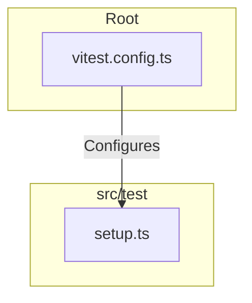
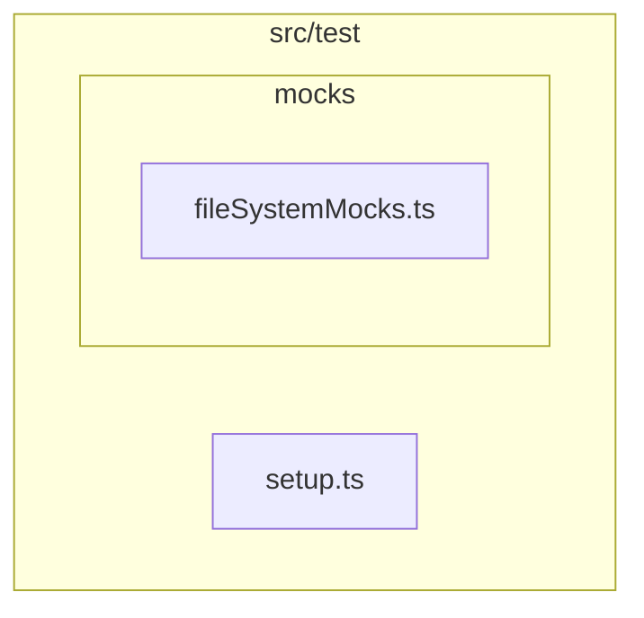

# External Documentation

## External Interactions Diagram

```mermaid
graph TD
    subgraph "Root"
        Vitest[vitest.config.ts]
    end

    subgraph "src/test"
        Setup[setup.ts]
    end

    Vitest -->|Configures| Setup
```

## Exposed Internal API

### `setup.ts`
Global test setup file executed before each test suite.
- **Environment**: Configures JSDOM extensions (e.g. `canvas` mock).
- **Cleanups**: Resets all mocks between tests to ensure isolation.
- **Extensions**: Adds custom matchers if any.

### `vitest.config.ts`
Primary test configuration.
- **Default Mode**: Runs in `jsdom` so local service and component tests do not require Playwright browsers.
- **Browser Mode**: Enabled only when `VITEST_BROWSER=1`, preserving the browser runner for cases that need it.

# Internal Documentation

## Internal Interactions Diagram

```mermaid
graph TD
    subgraph "src/test"
        Setup[setup.ts]
        subgraph "mocks"
            FSMocks[fileSystemMocks.ts]
        end
    end
```

## Internal Files and API

- `mocks/`: Specialized mocks for browser APIs (like File System Access API) that JSDOM doesn't support natively.
- Local CLI test commands wrap Vitest in a Node 20 runtime because the toolchain requires a newer Node version than the base container provides.
