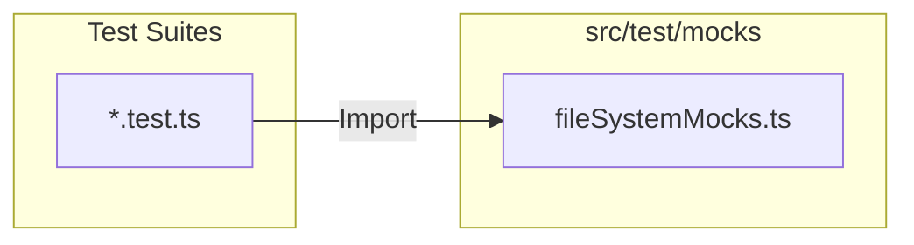
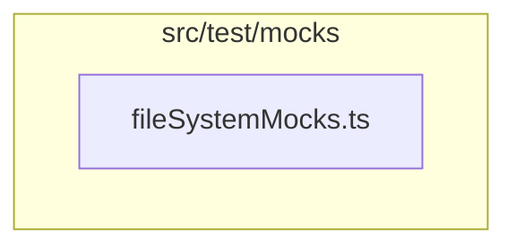

# External Documentation

## External Interactions Diagram

## Exposed Internal API

### `fileSystemMocks.ts`
Provides mock implementations for the Browser File System Access API.
- **Classes**: `MockFileSystemHandle`, `MockFileSystemDirectoryHandle`, `MockFileSystemFileHandle`.
- **Usage**: Used when testing services that interact with local files (e.g., `DirectoryAccessService`, `RunIngestionService`).

# Internal Documentation

## Internal Interactions Diagram

## Internal Files and API

### `fileSystemMocks.ts`
Implements a simplified in-memory version of the file system handles.
- **Async Iterators**: Correctly mocks `values()` and `entries()` as async generators.
- **Permission State**: Mocks `queryPermission` and `requestPermission` to always return 'granted' by default or be configurable.
