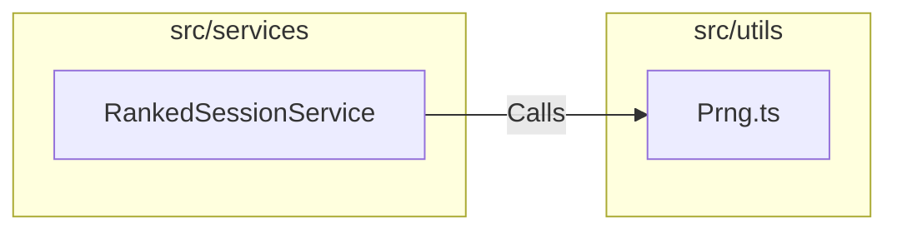

# External Documentation

## External Interactions Diagram

## Exposed Internal API

### `Prng.ts`
A deterministic **Pseudo-Random Number Generator**.
- **Purpose**: Used to generate reproducible sequences of scenarios for Ranked Sessions based on a daily seed or specific session ID.
- **Algorithm**: Implements a standard algorithm (e.g., Mulberry32) to ensure consistent behavior across different browsers and sessions.

# Internal Documentation

## Internal Files and API

(None - Pure utility functions)
